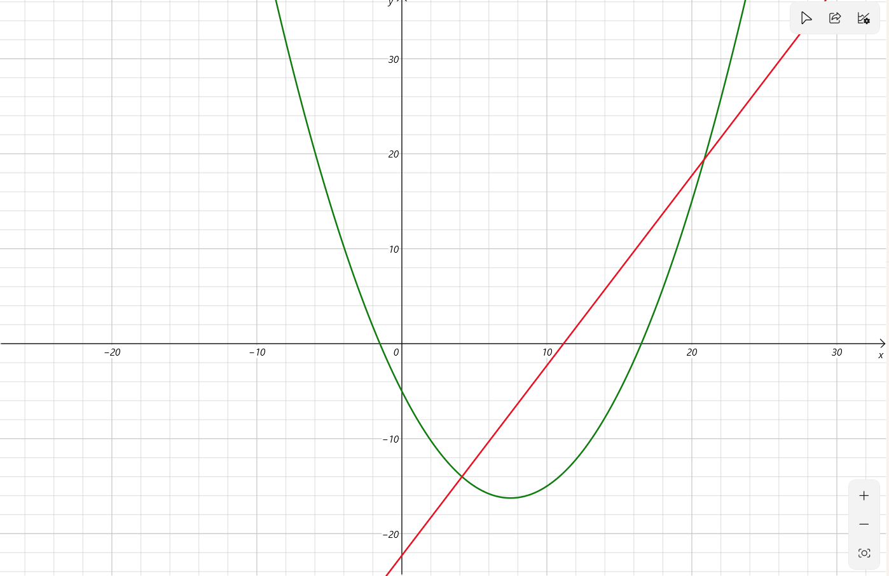

# 斜率优化

## 前情回顾

如果对于一个 1D/1D 动态规划，即状态一维且递推公式可以化简为 $f_i=\max\{f_j+w(i,j)\}$ 的形式的动态规划，这样的动态规划在 $w(i,j)$ 不含同时与 $i,j$ 相关的函数时可以使用单调队列优化，即可以写成

$$f_i=\max\{f_j+h_i+g_j\}=\max\{f_j+g_j\}+h_i$$

时可以使用单调队列优化。

但是，如果 $w(i,j)$ 中包含同时与 $i$ 和 $j$ 相关的项，在 $j$ 项一次的情况下，可以使用斜率优化来 $O(n)$ 或 $O(\log n)$ 地完成题目。

## 一般情况

对于一般式：

$$f_i=\max\{f_j+h_i+g_j-k_ix_j\}$$

我们首先去掉 $\max$：

$$f_i=f_j+h_i+g_j-k_ix_j$$

将只含有 $j$ 的移到等式左边，其它的移到等式右边：

$$f_j+g_j=k_ix_j-h_i+f_i$$

在转移 $i$ 项时，我们可以将只含 $i$ 的函数看成常常数，于是计 $b_i=-h_i+f_i$，然后又将只含有 $j$ 的函数看成变量，计 $y_j=f_j+g_j$，于是式子就变成了我们熟悉的一次方程的形式：

$$y_j=k_ix_j+b_i$$

其中 $k_i,b_i$ 为常量。

不难发现，我们想要最大化 $f_i$，就需要最大化 $b_i$，即最大化一次函数的截距。

考虑如果决策点又无穷多个，即在 $x<i$ 时 $x$ 是连续的，我们考虑什么时候取到截距的最大值。

在这里，直线斜率 $k=2$，则在曲线上的一点 $(x_0,y_0)$ 可以把这个直线系唯一确定，即 $y=2x+y_0-2x_0$。显然，在直线与曲线相切的时候，即 $\frac{\mathrm{d}y}{\mathrm{d}x}=k$ 的时候，发现截距最小。

同理，不难推出，一条折线上的顶点 $(x_0,y_0)$，当它与前一个点的斜率 $k_1\le k$，且与它后一个点的斜率 $k_2\ge k$ 时，有截距的最小值。同时，向内凹的点是绝对不优的，这保证了斜率优化中斜率序列的单调性，因此一般地，我们可以使用二分查找来实现 $O(n\log n)$ 的转移。

但同时，如果我们的转移点的斜率单调递增，那么曾经被舍弃掉的 $k$ 再往后一定不会被用到，因此这类似于头出尾进的队列，同时对内元素单调，很自然想到用单调队列继续优化成 $O(n)$。

## **(Warning!!!)** 注意事项

1. 再队列中存储的是下标编号，一定再访问时访问 `q[head]` 和 `q[tail]`，并且在 `+1` 时在 `head` 或 `tail` 里面加，如 `q[head+1]`。
2. 二分时比较 `slope` 的时候一定要 `mid` 与 `mid+1` 的斜率与给定斜率比较。
3. `double` 有时候会被 ~~良心~~ 出题人卡精度，因此在比较斜率的时候，当 $x$ 自变量单调递增，完全可以将分母乘到对面进行乘法的比较。

## 习题讲解