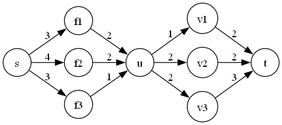
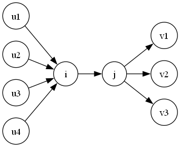
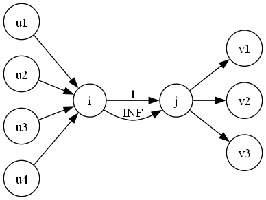

# 网络流

## 基本概念

我们现在有一张图 $G=\{V,E\}$，对于每一条边 $e\in E$，我们用 $(u,v,w)$ 来描述它，分别代表起点，终点和边权；并且这张图上有一个起点 $s$ 和一个终点 $t$，那么我们就可以称这个图是一张 **网络**。

另外的，对于这个起点 $s$，我们称之为 **源点**，对于终点 $t$，我们称之为 **汇点**。下面讲网络流几个基本概念。

### 弧

对于每一条边 $e=(u,v,w)\in E$，我们称之为 **弧**。而这里的 $w$ 被称为这条弧的容量。

### 流

对于一条 $u\to \dots \to v$ 的简单路径，我们称这是这张网络的一个 **流**。它满足以下性质：

- 对于流 $v_1\to\dots\to v_n$，它的大小必须小于等于 $\min\limits_{i=1}^{n-1}\{w_{(v_i,v_{i+1})}\}$。也就是说，流的大小小于等于路径上所有容量的最小值。
- 对于除源点和汇点之外的所有节点，总满足流进总流量等于流出总流量。

对于一张网络，我们希望给定一个确定的流，使得汇点的流量最大，这个问题叫做 **最大流问题**。

### 割

对于一个网络 $G=(V,E)$，我们将集合 $V$ 分成两份，变成 $S$ 和 $T$，其中 $s\in S,t\in T$，并且满足 $S\cup T=V,S\cap T=\emptyset$，则称这一种划分方式是这个网络的一个 **割**。而 **最小割问题** 就是希望找到一个割，使得 $\sum\limits_{u\in S,v\in T}w_{u,v}$ 最小。

### 残余网络

对于一个网络，如果我们已经在这张网络上进行了流的操作，则称流之后的网络为 **残余网络**。

## 最大流

### FF算法 (Ford-Fulkerson)

#### 算法过程

算法的基本思路是，对于一张残余网络，我们总找到一条 **增广路** 使得总流量增加。而对于顺序不对的情况，我们使用反向边来实现 **反悔** 的操作。

> **增广路**
>
> 对于一个流 $f=(s\to\dots\to t)>0$，则我们称这个流 $f$ 是该网络的一条增广路。简单来说，就是使总流量增加的路径。

于是找增广路就非常好实现，我们主要来看看怎么实现 **反悔** 操作。


如图网络。显然，对于这张网络，最大流就是 $10+20=30$，但是如果我们先流 $1\to 2\to 3\to 4$ 这一条路径，那么残余网络就变成：


然后流完 $(1\to 3\to 4)$ 之后就没了，得出来的最大流变成了 $20$。显然，这是我们流的顺序不当导致的。如何避免这种情况呢？我们考虑在每一条单向边顺带着连一条反边。如图：


由图可知，这些 **反边** 的容量初始是 $0$，额外的，我们在进行增广的时候，我们在减小正向边容量的同时增大反向边容量，比如对路径 $(1\to 2\to 3\to 4)$ 进行增广后，得到图：


可以看到，我们在进行一次增广之后，把反向边都加上了流量大小的容量，这就是接下来我们实施 **反悔** 操作的重要步骤。进行这一步操作之后，我们继续跑网络流，比如 $(1\to 3\to 4)$：


然后，我们惊奇的发现，这张图竟然还可以进行增广操作，也就是 $(1\to 3\to 2\to 4)$ 这一条增广路。于是增广之后，我们得到下图：


于是，我们这样得到的最大流就是 $30$。

对比原图，我们发现这个图的最终结果和直接增广 $(1,2,4)$ 和 $(1,3,4)$ 两条路径没有任何区别。也就是说，我们通过反悔操作，把我们以前的流不优时再流回去，实际上并不会对答案造成影响。这样，我们就把 $\text{FF}$ 算法学完了。

#### 复杂度分析

对于一次增广操作，它的复杂度是 $O(E)$，而这样的增广最多进行 $O(f)$ 次，这里 $f$ 就是最大流。这种情况发生在每次增广只能增加 $1$ 的情况。因此，$\operatorname{FF}$ 算法的时间复杂度上限为 $O(|E|f)$。

### $\text{EK}$ 算法

对于增广操作，我们也可以使用 $\operatorname{BFS}$ 完成每一次的增广操作。就是在残余网络中找到一个单轮的最大流，然后不断增广直至不能增广。这个算法在实际应用中并不广泛，因此了解思路即可。

#### $\operatorname{EK}$ 时间复杂度证明

这里我引用 $\text{oi-wiki.org}$ 中的证明，因为实在是太麻烦且没有必要了。

> **增广总轮数的上界的证明**
> 
> 首先，我们引入一个引理——最短路非递减引理。具体地，我们记 $d_f(u)$ 为 $G_f$ 上结点 $u$ 到源点 $s$ 的距离（即最短路长度，下同）。对于某一轮增广，我们用 $f$ 和 $f'$ 分别表示增广前的流和增广后的流，我们断言，对于任意结点 $u$，增广总是使得 $d_{f'}(u) \geq d_f(u)$。我们将在稍后证明这一引理。
> 
> 不妨称增广路上剩余容量最小的边是饱和边（存在多条边同时最小则取任一）。如果一条有向边 $(u, v)$ 被选为饱和边，增广会清空其剩余容量导致饱和边的消失，并且退流导致反向边的新增（如果原先反向边不存在），即 $(u, v) \not \in E_{f'}$ 且 $(v, u) \in E_{f'}$。以上分析使我们知道，对于无向边 $(u, v)$，其被增广的两种方向总是交替出现。
> 
> 在 $G_f$ 上沿 $(u, v)$ 增广时，$d_f(u) + 1 = d_f(v)$，此后残量网络变为 $G_{f'}$。在 $G_{f'}$ 上沿 $(v, u)$ 增广时，$d_{f'}(v) + 1 = d_{f'}(u)$。根据最短路非递减引理又有 $d_{f'}(v) \geq d_f(v)$，我们连接所有式子，得到 $d_{f'}(u) \geq d_{f}(u) + 2$。换言之，如果有向边 $(u, v)$ 被选为饱和边，那么与其上一次被选为饱和边时相比，$u$ 到 $s$ 的距离至少增加 $2$。
>
> $s$ 到任意结点的距离不可能超过 $|V|$，结合上述性质，我们发现每条边被选为饱和边的次数是 $O(|V|)$ 的，与边数相乘后得到增广总轮数的上界 $O(|V||E|)$。
>
>接下来我们证明最短路非递减引理，即 $d_{f'}(u) \geq d_f(u)$。这一证明并不难，但可能稍显绕口，读者可以停下来认真思考片刻。
>
>> 最短路非递减引理的证明
>>
>> 考虑反证。对于某一轮增广，我们假设存在若干结点，它们在该轮增广后到 $s$ 的距离较增广前减小。我们记 $v$ 为其中到 $s$ 的距离最小的一者（即 $v = \arg \min_{x \in V, d_{f'}(x) < d_f(x)} d_{f'}(x)$）。注意，根据反证假设，此时 $d_{f'}(v) < d_f(v)$ 是已知条件。
>>
>> 在 $G_{f'}$ 中 $s$ 到 $v$ 的最短路上，我们记 $u$ 是 $v$ 的上一个结点，即 $d_{f'}(u) + 1 = d_{f'}(v)$。
>>
>> 为了不让 $u$ 破坏 $v$ 的「距离最小」这一性质，$u$ 必须满足 $d_{f'}(u) \geq d_f(u)$。
>>
>> 对于上式，我们令不等号两侧同加，得 $d_{f'}(v) \geq d_f(u) + 1$。根据反证假设进行放缩，我们得到 $d_f(v) > d_f(u) + 1$。
>>
>> 以下我们尝试讨论 $(u, v)$ 上的增广方向。
>>
>> 假设有向边 $(u, v) \in E_f$。根据 $BFS$「广度优先」的性质，我们有 $d_f(u) + 1 \geq d_f(v)$。该式与放缩结果冲突，导出矛盾。
>>
>> 假设有向边 $(u, v) \not \in E_f$。根据 $u$ 的定义我们已知 $(u, v) \in E_{f'}$，因此这条边的存在必须是当前轮次的增广经过了 $(v, u)$ 并退流产生反向边的结果，也即 $d_f(v) + 1 = d_f(u)$。该式与放缩结果冲突，导出矛盾。
>>
>> 由于 $(u, v)$ 沿任何方向增广都会导出矛盾，我们知道反证假设不成立，最短路非递减引理得证。

~~（这个证明比我前面写的加起来还长）~~

### $\operatorname{Dinic}$ 算法

考虑提前进行 $BFS$ 分层，然后使用 $DFS$ 跑增广路。具体地，我们跑 $BFS$，给每一个 $v\in V$ 一个 $dep$ 表示到源点 $s$ 的最短距离。然后，在 $DFS$ 的时候，我们的增广路 $v_1 \to \dots\to v_n$，对于 $\forall i\in[1,n-1]$，总存在 $dep_i=dep_{i+1}-1$。也就是说，对于一个点 $u$，我们只流给它的下一层。因此，我们称这个分完层之后的残余网络为 $G=(V,E)$ 网络的一个层次图。而我们称在这张图上的最大增广为 **阻塞流**。

我们希望一次求出整张层次图的最大流，因此我们就需要多路增广。但是，对于每一次搜到一个点，可能前面的路径已经流完了，必须从当前的弧开始，因此，我们可以到一个点记录一下现在这个点流到了第几个弧，然后再流到这个点的时候就可以从上次没流完的开始流。这个常数优化我们称为当前弧优化。



如图，模拟网络流过程，从 $(s\to f_1\to u)$ 进行增广，于是 $u$ 获得流量 $2$，然后把这些流量进行分配，也即 $(u\to v_1\to 1)$ 流过 $1$，$u\to v_2\to 1$ 流过 $1$。无法继续增广，于是，返回 $s$ 节点，通过 $(s,f_2,u)$ 给 $u$ 大小为 $2$ 的流量。注意，此时，$u$ 就不用流到 $v_1$ 了，继续流没有流完的 $v_2$ 即可。因此，这里就体现出了当前弧优化。

代码也非常简单：

```cpp
int n,m,s,t;
int Next[M], head[N], w[M], ver[M], tot=-1;
void add(int x,int y,int z){
	ver[++tot]=y;
	w[tot]=z;
	Next[tot]=head[x];
	head[x]=tot;
}
int ans,dep[N],cur[N];

queue<int> q;
bool bfs(){
	while(!q.empty())	q.pop();
	for(int i=1;i<=n;++i)	dep[i]=INF;
	cur[s]=head[s], q.push(s), dep[s]=0;
	while(!q.empty()){
		int p=q.front(); q.pop();
		if(p==t)	return true;
		for(int i=head[p];~i;i=Next[i]){
			int y=ver[i], z=w[i];
			if(z>0&&dep[y]==INF){
				q.push(y);
				cur[y]=head[y]; dep[y]=dep[p]+1;
			}
		}
	}
	return false;
}
int dfs(int x,int flow){
	if(x==t)	return flow;
	int maxflow=0;
	for(int i=cur[x];~i&&flow;i=Next[i]){
		cur[x]=i;
		int y=ver[i], z=w[i], k;
		if(dep[y]==dep[x]+1&&(k=dfs(y,min(flow,z)))){
			w[i]-=k, w[i^1]+=k;
			maxflow+=k, flow-=k;
		}
	}
	return maxflow;
}

signed main(){
	memset(head,-1,sizeof(head));
	ios::sync_with_stdio(false);
	cin.tie(0), cout.tie(0);
	cin>>n>>m>>s>>t;
	for(int i=1,x,y,z;i<=m;++i)	cin>>x>>y>>z, add(x,y,z), add(y,x,0);
	while(bfs())	ans+=dfs(s,INF);
	cout<<ans<<endl;
	return 0;
}
```

最大流问题中，基本上 $\text{Dinic}$ 就很够用了，但还有一个 $\text{Dinic}$ 的常熟优化版本：$\operatorname{ISAP}$，这种算法只需要在 $dfs$ 之前进行一遍 $BFS$ 分层。但是，$BFS$ 的复杂度是 $O(|E|)$，而一遍 $DFS$ 是 $O(|E||V|)$，所以优化极小。

## 最小割

我们之前已经说过最小割问题的定义，我们现在就来讨论怎样完成这个问题。

首先，看一个定理：

> **最大流最小割定理**
>
> 对于一张网络 $G=(E,V)$，它的最大流为 $f$，最小割为 $\|S,T\|$，则有 $f=\|S,T\|$。

这个定理直接指出了最大流与最小割之间的关系，我们对于最小割的研究也就很方便了。

关于证明，这里从略，有兴趣可以去看 $\text{oi-wiki}$ 上的详细证明。

## 最小费用最大流

> **Warning**
>
> 这里是在保证 **最大流** 的基础上进行最小费用操作的。

具体地，对于每一条弧 $(u,v)$，我们不仅有一个 $w$ 容量，而且还有一个单位容量花费 $cost$，也就是说，如果有一个流 $f$ 流过这条弧，那么会产生 $f\times cost$ 的花费，要求最大流的前提下最小化花费。

首先要明确，一条增广路上的花费为 $f\sum\limits_{e\in E} cost_e$。这很好理解，因为每经过一条弧就要加上 $f\times cost$ 的费用，一共就是 $f\times \sum\limits_{e\in E}cost_e$ 的花费了。

我们惊奇的发现一条路径上花费只与流量和单位花费有关，而因为最大流是一定的，所以我们只需要最小化 $\sum\limits_{e\in E}cost_e$ 即可。因此，我们可以进行贪心求解，也就是每一次求出费用和最小的增广路进行增广，到最后费用就一定最小了。其中，值得注意的是，我们对于路径 $(u,v,w,cost)$ 的反边需要设置成 $(v,u,0,-cost)$。也就是说，在反悔的时候，一定是费用再倒退回去。这也给我们一个启示：虽然容量不能为负，但是费用可以。

而求最短路的过程，我们选择使用 $SPFA$，因为虽然它的复杂度不对，但是仍然是在不卡的时候很有力的工具。而不适用 $n\log n$ 的 $dijkstra$ 的原因是它无法处理负边。但是我们仍然可以使用一些特殊手段来处理负边，比如使用 $Johnson$ 全源最短路算法中的是能思想。

```cpp
queue<int> q;
bool vis[N];
int dis[N], cur[N];
bool spfa(){
	for(int i=1;i<=n;++i)	dis[i]=INF, vis[i]=false;
	q.push(s), dis[s]=0;
	while(!q.empty()){
		int x=q.front(); q.pop();
		// cout<<x<<" "<<endl;
		vis[x]=false; cur[x]=head[x];
		for(int i=head[x];~i;i=Next[i]){
			int y=ver[i], z=w[i], cost=pay[i];
			if(z&&dis[y]>dis[x]+cost){
				dis[y]=dis[x]+cost;
				if(!vis[y])	q.push(y);
			}
		}
	}
	return dis[t]!=INF;
}
int dfs(int x,int flow){
	if(x==t||flow==0)	return flow;
	int maxflow=0, f;
	vis[x]=true;
	for(int &i=cur[x];~i;i=Next[i]){
		int y=ver[i], z=w[i], cost=pay[i];
		if(!vis[y]&&dis[y]==dis[x]+cost&&(f=dfs(y,min(flow,z)))){
			w[i]-=f, w[i^1]+=f, maxflow+=f, flow-=f, minn+=cost*f;
			if(flow==0)	return maxflow;
		}
	}
	vis[x]=false;
	return maxflow;
}
```

## 经典建模套路

### 拆点

在网络流中，往往有这样一个限制：每个状态只能选择一次，或者每个状态只能贡献一次。对于这种数量的限制，我们就可以使用拆点来实现。

#### 只能选择一次

对于这种问题，我们把一个点 $i$ 拆成 $i$ 与 $i+n$ 两个点，如图所示：



其中 $j=i+n$。注意，这里 $i$ 作为入点，以前所有连向 $i$ 的边都连向 $i$，然后 $j$ 作为出点，以前所有从 $i$ 出发的都由 $j$ 往外出发。而在 $i\to j$ 中间也连一条边，其中这条边容量为 $0$，这样我们就已经保证了 $i$ 只允许被遍历一遍。

#### 只能贡献一次

对于这个问题，我们就要考虑费用流了。显然，我们是无法只使用最大流来约束双重状态的。因此，这一次仍然是把 $i$ 拆成 $i$ 和 $i+n$，但是连边不一样，如图：



注意到，这一次我们在 $i,i+n$ 之间连了两条边，其中一条是 $(i,i+n,1,a)$，另一条是 $(i,i+n,INF,0)$。其中 $a$ 表示贡献。这就是说，从 $i$ 到 $i+n$ 有两种路线，第一种是拿贡献的，第二种是不拿的，显然在跑最大费用最大流的时候会优先选择第一种路线，这样我们就跑出来了最大贡献。另外，在最大贡献最大流中，我们可以把贡献的相反数存进去然后求最小费用最大流，最后取负即可。

### 最大权闭合子图模型

#### Description

首先我们讲讲闭合子图的概念。对于一张图 $G=(V,E)$，如果它的一个点集的子集 $V'$ 满足所有 $v\in V'$ 的出边都在 $V'$ 中，那么称这个子图是 $G=(V,E)$ 的一个闭合子图。而最大权闭合子图，就是给定每个点一个权值 $a_v$，要求最大化闭合子图的权值和。

#### Solution

首先注意，这个问题肯定不保证权值非负，否则直接全集就是最优解。考虑，选择一个集合也就等价于把所有的点分成两类，一类是选的，一类是不选的，并且其中选的有一部分是代价，有一部分是贡献。

具体做法是，把所有权值是正的点连到虚拟源点 $s$ 上，容量为 $a_v$，所有的权值是负的点都连到虚拟汇点 $t$ 上，容量是 $-a_v$。这有很大一个原因是网络流不允许负容量。另外，我们需要把所有 $(u,v)$ 的关系建立一条边，容量为 $INF$。然后，把所有的点分成两个部分，是不是就是把这个图割成两个分别与 $s$ 和 $t$ 相连的集合？于是，我们在这张图上跑最小割，再用所有正权和减去最小割就是答案。

考虑为什么是对的，首先，$(u,v)$ 的容量是 $INF$ 保证了我们不会割这一条边，也就是说，我们满足了 $(u,v)$ 不会被割这个条件。然后把这个东西割成了两个部分，我们把正权且与 $s$ 属于一个集合的点成为贡献点，负权与 $s$ 属于一个集合的叫做代价点，正权的与 $t$ 属于一个集合的叫做舍弃的贡献点，相应的，负权与 $t$ 相连的点叫做舍弃的代价点。那么，我们的最小割割的边不就是所有的舍弃的贡献点到 $s$ 的边和所有代价点到 $t$ 的边吗？而用所有正权点的权值和减去最小割，不就是减去不选的正权点，并且减去代价点吗？这就在感性上证明了为什么答案是对的。

### 最小路径覆盖

对于一张有向无环图(DAG) $G=(E,V)$，我们希望找到其中的 $m$ 跳路径 $e$，若每个路径的包含的点集为 $V_i$，则这 $m$ 条路径所包含的路径满足 $\bigcap\limits_{i=1}^m V_i=\emptyset$，$\bigcup\limits_{i=1}^m=V$，则称这个路径划分是 $G$ 的一个路径覆盖。而最小路径覆盖就是要求最小化 $m$ 的路径覆盖。

这里给一个结论：我们把每个点 $i$ 拆成两点 $i$ 与 $i+n$，然后对于原图上的 $e=(u,v)\in E$，在网络上连 $(u,v+n)$，$(s,i),(i+n,t),i\in [1,n]$，则最后最小路径覆盖=点数量-最大流。

> **证明**
>
> 我们考虑反向合并。也就是说，我们先把每个点看成一条路径，这样路径就是 $n$ 条，我们要最小化路径数量，就可以在两条路径之间连边，也就是说，原本有路径 $u\to\dots\to x$ 和 $y\to\dots\to\ v$，而且正好有边 $x\to y$，于是我们可以合并两条路径变成 $u\to\dots\to x\to y\to\dots\to v=u\to\dots\to v$。这样我们就把需要的路径减少了一个，而我们要求的就变成了能减少的路径，或者说能合并的路径的数量。
>
> 于是考虑网络流，因为每个点只能够被一个点合并并且只能合并一个点，因此我们给每个点连边 $(s,i,1)$ 和 $(i+n,t,1)$ 表示每个点只能产生 $1$ 的贡献。然后每一个点可以选择合并的点都包含在 $E$ 中，只需要对于每一个 $(u,v)$，都连一条 $(u,v+n,1)$，就可以表示 $u$ 可以合并 $v$，最后跑出来就是可以合并的点的最大值。而拆点是因为我们总需要一个被合并和一个合并的点，如果不拆那么光是 $(s,i,1)$ 和 $(i,t,1)$ 两种边就可以把最大流拉到最大，变成 $n$ 了。

### 二分图最大匹配模型

首先，我们介绍二分图的基本概念。

对于图 $G=(E,V)$，我们把 $V$ 分成 $V_1$ 和 $V_2$ 使得 $V_1\cup V_2=V,V_1\cap V_2=\emptyset$，并且 $\forall e=(u,v)\in E$，都满足 $u,v$ 不在一个集合中，则称这张图是一张 **二分图**。而二分图最大匹配，就是在 $V_1,V_2$ 中找到一组对应关系，使得组数最多。其中一个对应关系可以表示为 $(u,v)$，其中 $u\in V_1, v\in V_2$ 并且存在 $e=(u,v)\in E$。而且每个点只能与一个点匹配。

为了解决这个模型，我们建立连边：

1. $(s,u,1),u\in V_1$。
2. $\forall e=(u,v)\in E,(u,v,1)$。
3. $(u,t,1),u\in V_2$。

然后跑网络流最大流即可。

> **证明**
>
> 题目中给出的约束无非以下几点：
>
> 1. 每个点只能匹配一个点。
> 2. 匹配的点之间必须有连边。
>
> 而对于第一个限制，我们让所有 $(s,u)$ 和 $(u,t)$ 容量都只有 $1$。对于第二个限制，我们只需要在建立连边的时候在两个有边的地方加入一条弧 $(u,v,1)$。
>
> 这样，这个网络的意义就是让每个点选择流向那个点，流过去就可以获得一点贡献，而且每个点只能流一遍。因此，我们流出的总流量就是二分图最大匹配。

## 例题选讲

### P2774 方格取数问题

#### Description

有一个 $n\times m$ 的网格，每个格子中有一个权值 $a_{i,j}$。现在要求选择格子，并且相邻的格子不能被同时选择，求选择的最大权值和。

#### Solution

考虑这就是一个限制条件的网络流模型。具体地，它要求选择了 $(i,j)$ 之后就不能选择 $(i+1,j),(i-1,j),(i,j+1)$ 和 $(i,j-1)$。因此，可以套用最大权闭合子图模型。

具体地，我们发现如果把计 $sum=\sum\limits_{i=1}^n\sum\limits_{j=1}^ma_{i,j}$，那么它多算的部分就是所有的要选的 $(i,j)$ 周围的部分。而如果我们把周围的部分看成是负权值，也就代表了我们选择 $(i,j)$ 就必须选择它四周的点，而这些点权值为负，就相当于减去了这些点。因此使用最大权闭合子图模型即可。

```cpp
queue<int> q;
int cur[N*N], dep[N*N];
bool bfs(){
	for(int i=s;i<=t;++i)	dep[i]=INF;
	dep[s]=0, q.push(s);
	while(!q.empty()){
		int x=q.front(); q.pop();
		cur[x]=head[x];
		for(int i=head[x];~i;i=e[i].nxt){
			int y=e[i].v, w=e[i].w;
			if(dep[y]==INF&&w)	dep[y]=dep[x]+1, q.push(y);
		}
	}
	return dep[t]!=INF;
}
int dfs(int x,int flow){
	if(x==t||flow==0)	return flow;
	int maxflow=0, f;
	for(int &i=cur[x];~i;i=e[i].nxt){
		int y=e[i].v, w=e[i].w;
		if(dep[y]==dep[x]+1&&(f=dfs(y,min(flow,w)))){
			e[i].w-=f, e[i^1].w+=f, flow-=f, maxflow+=f;
			if(flow==0)	return maxflow;
		}
	}
	return maxflow;
}

int main(){
	ios::sync_with_stdio(false);
	cin.tie(0), cout.tie(0);
	memset(head,-1,sizeof(head));
	cin>>n>>m; s=0, t=n*m+1;
	for(int i=1;i<=n;++i)
		for(int j=1;j<=m;++j){
			cin>>a[i][j]; ans+=a[i][j];
			int x=Hash(i,j);
			if((i+j)%2)	add(s,x,a[i][j]), add(x,s,0);
			else	add(x,t,a[i][j]), add(t,x,0);
		}
	for(int i=1;i<=n;++i)
		for(int j=1;j<=m;++j){
			int x=Hash(i,j);
			if((i+j)%2==0)	continue;
			for(int k=0;k<4;++k){
				int ii=i+dx[k], jj=j+dy[k];
				if(ii<=0||ii>n||jj<=0||jj>m)	continue;
				int y=Hash(ii,jj);
				add(x,y,INF), add(y,x,0);
			}
		}
	while(bfs())	ans-=dfs(s,INF);
	cout<<ans<<endl;
	return 0;
}
```
