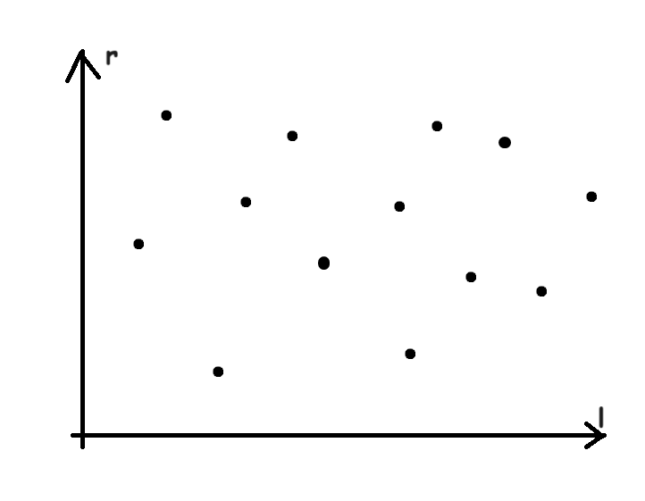
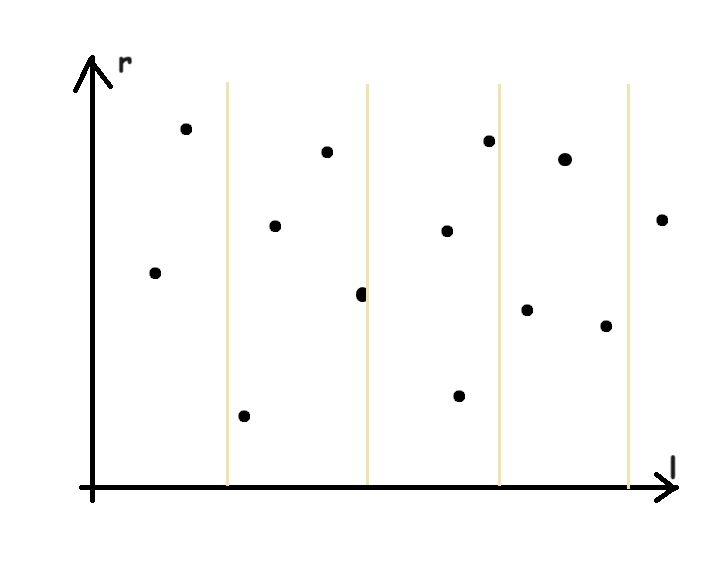
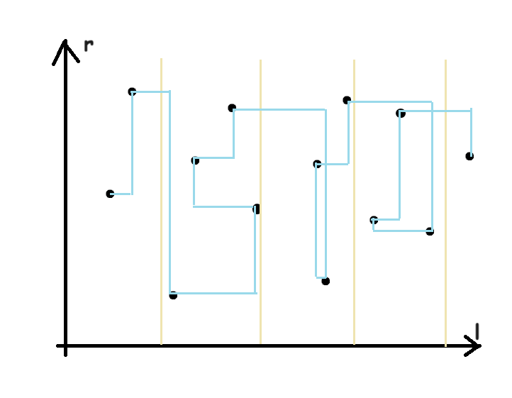
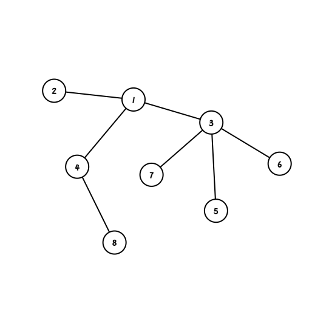

# <center> 莫队 </center>

#### <p align = "right"> ——优雅的暴力 </p>

## 基本思想

对于区间操作问题，如果我们并 **不需要在线（重点！）**，并且我们可以快速地完成下面四个区间转换操作：

$$(l,r)\to (l+1,r)$$

$$(l,r)\to (l, r+1)$$

$$(l,r)\to (l-1, r)$$

$$(l,r)\to (l,r-1)$$

那么我们就可以通过对处理区间的顺序进行重新排列，那么我们就可以在 $O(n\sqrt n)$ 的复杂度内完成全部区间操作。

### 算法描述

对于一些询问区间 $[l_i, r_i]$，加入我们把这些询问看成平面直角坐标系上的点，$l_i$ 对应横坐标，$r_i$ 对应纵坐标，那么我们可以画出一张图：



然后我们按照横坐标分块，取块长为 $B$：



在每个块内，按照纵坐标排序。显然，我们要转移的步数就是两点之间的曼哈顿距离。于是我们可以画出转移的路径：



乍一看感觉我们需要更新的路径非常长，但是我们仔细分析就会发现复杂度极其正确。

首先，对于块内，横坐标的移动距离一次一定不超过块长，也就是说移动一次横坐标一定是 $O(B)$ 的复杂度。而对于纵坐标，因为我们已经从小到大排序了，因此在一个块内走的复杂度是 $O(N)$。块之间横坐标复杂度仍然不变，纵坐标复杂度也是 $O(N)$，因此我们需要 $O(NB+\frac{N^2}{B})$，显然当 $B = \sqrt N$ 的时候取到最小值，即复杂度为 $O(N\sqrt N)$。

### 实现细节

#### 卡常技巧

注意到，普通莫队的重要操作是移动区间，那么这里会分为四个子问题，即向四个不同的方向转移。这个我们可以写成函数来分别完成，但注意卡常的时候尽量不要写成函数。

#### 区间操作顺序

另外，四种操作的顺序仍需注意。如果遇到区间 $r<l$，就会在某些情景下造成不合法。因此我们总是先对 $l,r$ 端点进行拓张操作，即：

$$(l,r)\to \begin{cases}(l-1, r)\\(l,r+1)\end{cases}$$

然后再进行缩区间操作：

$$(l,r)\to\begin{cases}(l+1,r)\\(l,r-1)\end{cases}$$

#### 莫队配合分块

在进行操作的时候，如果我们不能够做到 $O(1)$ 修改或查询，那我们可以考虑使用分块。对于单点修改操作，显然对于分快来说大部分都是 $O(1)$，而对于查询操作，分块的复杂度是 $O(\sqrt n)$。而查询只有 $m$ 个。这样正好分块与莫队在 查询/修改 时 **取长补短**，完成了根号算法的完美融合。最终复杂度 $O((n+m)\sqrt n)$。

#### 奇偶优化

在块间转移的时候，显然我们并不需要每次从最上方转移到最下方。我们只需要对于奇数块从小到大排列 $r$，偶数块从大到小排列 $r$，这样在奇偶交界的时候就可以少一些转移。

## 普通莫队经典例题

### [P1972 [SDOI2009] HH的项链](https://www.luogu.com.cn/problem/P1972)

求区间内不同的数的个数。

考虑已知一个区间 $(l,r)$，如何修改区间。

对于每个权值，我们开一个桶记录出现了多少次。如果由 $0\to 1$，我们就给答案加一；如果 $1\to 0$，就给答案减一。

但是这么做对于 $10^6$ 的数据显然过不去。这时候我们想起了树状数组怎么做这个题。也就是说，对于一个数 $a_i$，我们记录 $lst_{a_i}$ 表示 $a_i$ 上一次出现在哪。而对于询问 $l,r$，我们只需要统计 $l,r$ 中出现的且上一次出现在 $[1,l)$ 的数的个数。使用莫队维护这个东西即可。

## 莫队进阶

### 带修莫队

如果在查询中混入了修改操作，那么问题会变得稍许棘手。

这样我们需要额外维护一个时间纬度 $t$，表示该询问是进行了多少次修改操作之后进行的。这样我们得到了一个三元组 $(l,r,t)$。我们对三元组的前两元 $l$ 和 $r$ 分块，然后按照 $l$ 所在块为第一关键字、$r$ 所在块为第二关键字、$t$ 为第三关键字进行排序。这样得到的东西跑完之后复杂度是 $O(n^{\frac{5}{3}})$（虽然但是我不会证）。

于是乎，我们又需要进行一个新的操作：修改。

我们需要把时间维度调整到我们需要的 $t$，这就需要两个操作：增加操作和撤销操作。对于修改操作，我们直接根据题意修改即可，但一定要注意如果进行修改需要考虑贡献需不需要加入到最终的答案当中。这就需要我们判断修改的点在不在当前询问范围之内。在修改完成之后，我们交换修改值和要修改的值，这样就能够在下次重新进行撤销操作的时候得到正确的修改值。

### 树上莫队

对于树上路径问题，我们仍然可以通过某些算法转换成莫队的问题。

#### 前置知识：括号序列

在一棵树上，我们从根节点开始进行 `dfs`，那么每个节点会有一次入栈操作和一次出栈操作。那么，我们重新开一个栈，在入栈和出栈的时候都将该节点弹入新的栈中，那么得到的栈就是该树的一个括号序列。

例如下图：



根节点是 $1$，那么根绝节点编号决定遍历顺序，那么该树的括号序列就是这样：$1,2,2,4,8,8,4,3,5,5,6,6,7,7,3,1$。现在任取两点，如 $(6,8)$，首先判断它们是不是祖先儿子的关系，发现不是之后直接取 $8$ 出栈到 $6$ 入栈中间的序列，即 $8,4,3,5,5,6$，于是我们发现，只出现了一次的点都是路径上的节点，而出现两次的则不是。另外，它们的最近公共祖先 $1$ 也不在序列内，这需要特殊处理。

再比如 $(1,7)$，发现它们是祖先儿子关系，于是取 $1$ 入栈到 $7$ 入栈的区间，即 $1,2,2,4,8,8,4,3,5,5,6,6,7$，发现仍然是所有的只出现一次的点都在路径上。而且这时它们的最近公共祖先 $1$ 也在路径上。

#### 假·树上莫队

于是，根据括号序列，我们就可以求出树上路径所对应的一个区间，在这些区间上我们使用莫队维护即可。具体地，我们开一个 `appear[N]` 表示在序列中某个点是否出现。每次遇到括号序列的一个点的时候修改一下 `appear` 的值即可，如果是 $1$ 则加上贡献，否则减去贡献。

这个东西不能够叫做严格的树上莫队，但是仍然可以解决大部分问题。

### 压位 $\text{Trie}$

#### <p align = "right"> ——这是一个比 $set$ 优秀的平衡树 </p>

考虑一个 **64 叉树**，显然，对于一个正常值域的操作，没往上会除以 $64$ 的大小，因此一般 $2^{20}$ 的 $\log$ 可以优化到 $2^4$，即 $O(4)$ 的复杂度。而且在期间操作还都是位运算操作巨快，可以认为是 $O(1)$ 做到加入、删除、查找前驱后继。于是乎，一些与序列位置有关的莫队就会变得非常简单。

### 回滚莫队

考虑如果有操作不好考虑删除但添加简单，或者不好添加但是删除简单，我们就可以使用回滚莫队。

回滚莫队的本质是尽量减少需撤销的操作次数，于是，根据我们的定义，可以进行一部分可接受的劣化，以达到减少撤销次数的目的：

首先，我们枚举块，接下来之操作左端点在块内的区间。

显然，如果右端点也在这个块里面，我们就直接暴力求出答案。这是因为长度小于 $\sqrt n$ 的区间暴力加起来也最多是 $n\sqrt n$ 的复杂度，完全可以接受。而对于右端点不在区间内的，我们先初始化 $l,r$ 为该块的右端点，然后向右拓展 $r$。而对于左端点，因为刚开始在块的右端点，因此需要向左拓展。这就保证了这操作只需要加。

在处理完这个区间之后，右端点不需要再加操作，因为右端点已经排序。而左端点需要 **滚回** 块的右端点。这就需要我们记录一下左端点的影响然后一步步撤销了。

具体地，我们进行以下操作；

- 枚举块的编号 $i$ 并将左端点初始化为块的右端点 $+1$，右端点初始化为左端点 $-1$。
- - 接着，我们进入内层循环枚举询问的编号 $j$ 使得询问的左端点在块内。
- - 如果一个区间在整个块内，我们暴力维护。
- - 然后，因为右端点在一个块内一定单调不降（**注意回滚莫队不能够使用奇偶排序**），因此一定不会有右端点的撤回操作，我们直接将右端点更新到目前的查询右端点即可。
- - 对于左端点，我们不断向左拓展并且记录操作，以方便在回滚时候的撤销。

这时候我们分析复杂度，右端点每个块内是 $O(n)$，左端点每个询问是 $O(B)$，暴力处理的询问每个是 $O(B)$。因此总复杂度为 $O(\frac{n}{B}n+mB)$，$n,m$ 同阶时 $B$ 取 $\sqrt n$ 即可。

### $\text{bitset}$

这个比较抽象，我们直接看一个例题：

> 给定序列 $a_n$，一次询问描述为 $op,l,r,x$，表示：
>
> - $op=1$ 时询问 $l,r$ 内是否存在 $i,j$ 使得 $a_i-a_j=x$。
> - $op=2$ 时询问 $l,r$ 内是否存在 $i,j$ 使得 $a_i+a_j=x$。
> - $op=3$ 时询问 $l,r$ 内是否存在 $i,j$ 使得 $a_i\times a_j=x$。

显然一般地莫队并不好维护，但是如果我们对所有的点 出现/没出现 维护一个 $\text{bitset}$，然后开始操作：

对于 $a_i-a_j=x$，于是有 $a_j=a_i-x$，因此，如果 $i$ 位置有一个数，只需要在 $i-x$ 的位置也有一个数即可使得 $a_i-a_j=x$。于是，只要这个 `bitset<N> f` 有 `f&(f>>x)` 就能使得这个询问成立。

对于 $a_i+a_j=x$，这时候需要有 $a_j=x-a_i$，这时候发现有一个 $-a_i$，因此我们需要维护一个 $b_i=maxn-a_i$ 的 $\text{bitset}$，相当于把原来的倒转过来。这时候，就有 $x-a_i=x+b_i-maxn=b_i+(maxn-x)$，也就是说，只需要给 `bitset<N> b` 左移 $maxn-x$ 位即可。

最后一个操作就比较简单，因为操作次数只有 $O(m)$，直接 $\sqrt n$ 枚举因子，判断 $i,\frac{x}{i}$ 是不是都在即可。

## 经典例题

### Count on a Tree II

给定一棵树和点的颜色，求一条路径上的颜色数量。

这个显然可以用 **假·树上莫队** 维护。具体地，我们维护括号序列，然后再开一个颜色数量统计和一个区间内出现与否，这样，在更新的时候我们直接记录一个 `appear[N]` 数组表示 $x$ 有没有出现过，直接异或即可。~~（主要是看看莫队代码）~~

```cpp
int n, m, a[N], x[N], y[N], nn, sum, ans[N], b[N], col[N];
bool appear[N];
struct node{
	int l, r, id, x, y;
	bool operator <(const node &other) const{
		if(l/nn == other.l/nn)  return (l/nn%2)?r>other.r:r<other.r;
		return l/nn < other.l/nn;
	}
}range[N];
vector<int> g[N];
int fa[N][20], st[N], top, t, in[N], out[N], dep[N];

void dfs(int x,int fat){
	fa[x][0] = fat; st[++top] = x, in[x] = top;
	dep[x] = dep[fat] + 1;
	for(int i=1;i<=t;++i)   fa[x][i] = fa[fa[x][i-1]][i-1];
	for(int y:g[x])
		if(y!=fat)  dfs(y, x);
	st[++top] = x, out[x] = top;
}

void add(int x){
	if(appear[x] ^= 1)	sum += ((++col[a[x]]) == 1);
	else	sum -= ((--col[a[x]]) == 0);
}
int LCA(int x,int y){
	if(dep[x] < dep[y])	swap(x, y);
	for(int i=t;i>=0;--i)
		if(dep[fa[x][i]] >= dep[y])	x = fa[x][i];
	if(x == y)	return x;
	for(int i=t;i>=0;--i)
		if(fa[x][i] != fa[y][i])	x = fa[x][i], y = fa[y][i];
	return fa[x][0];
}

signed main(){
	ios::sync_with_stdio(false);
	cin.tie(0), cout.tie(0);
	cin>>n>>m; nn = sqrt(2*n), t = log2(n)+0.5;
	for(int i=1;i<=n;++i)   cin>>a[i], b[i] = a[i];
	sort(b+1, b+1+n);
	int cnt = unique(b+1, b+1+n) - b - 1;
	for(int i=1;i<=n;++i)   a[i] = lower_bound(b+1, b+1+cnt, a[i]) - b;
	for(int i=1,x,y;i<n;++i)	cin>>x>>y, g[x].pb(y), g[y].pb(x);
	dfs(1, 0);
	for(int i=1;i<=m;++i){
		cin>>x[i]>>y[i];
		if(in[x[i]] > in[y[i]])	swap(x[i], y[i]);
		if(out[x[i]] >= out[y[i]])	range[i] = node{ in[x[i]], in[y[i]], i, x[i], y[i]};
		else	range[i] = node{ out[x[i]], in[y[i]], i, x[i], y[i]};
	}
	sort(range+1, range+1+m);
	int l = 1, r = 0;
	for(int i=1;i<=m;++i){
		while(r<range[i].r)	add(st[++r]);
		while(l>range[i].l)	add(st[--l]);
		while(r>range[i].r)	add(st[r--]);
		while(l<range[i].l)	add(st[l++]);
		int lca = LCA(range[i].x, range[i].y);
		if(lca != range[i].x && lca != range[i].y)	ans[range[i].id] = sum + (col[a[lca]] == 0);
		else	ans[range[i].id] = sum;
	}
	for(int i=1;i<=m;++i)	cout<<ans[i]<<endl;
	return 0;
}
```

### [P5268 [SNOI2017] 一个简单的询问](https://www.luogu.com.cn/problem/P5268)

给定一个序列，定义

$$\operatorname{get}(l,r,x)=\sum_{i=l}^r[a_i=x]$$

对于每个询问 $(l_1,r_1,l_2,r_2)$，求

$$\sum_{x=0}^{\infty}\operatorname{get}(l_1,r_1,x)\times \operatorname{get}(l_2,r_2,x)$$

这个东西直接弄显然是不好的，因为它需要我们维护两个区间。但是，我们可以试着将这两个区间拆开来看：

令

$$g(t,x)=\sum_{i=1}^t[a_i=x]$$

于是显然有

$$\operatorname{get}(l,r,x)=g(r,x)-g(l-1,x)$$

于是原式可以化成：

$$\sum_{x=0}^{\infty}\operatorname{get}(l_1,r_1,x)\times \operatorname{get}(l_2,r_2,x)=\sum_{x=0}^{\infty}(g(r_1,x)-g(l_1-1,x))\times(g(r_2,x)-g(l_2-1,x))$$

这样，每个询问可以拆成四个询问，然后每个询问就好做了。

但是和普通莫队不一样的是，这里左端点也是往右加入点往左删除点，但其实也不麻烦，很好理解。

### [P3709 大爷的字符串题](https://www.luogu.com.cn/problem/P3709)

给定一个字符串，对于
