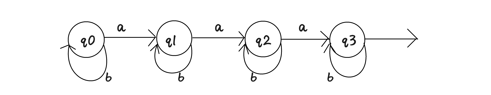

# 自动机

> **什么是自动机**
>
> 对于一个字符串问题，我们需要设计好一种状态集合以及转移集合，使得对于给定字符串 $s$，我们只要把它扔进自动机里面就可以跑着跑着跑出我们需要的答案。

## DFA（确定有限自动机）

我们来看一个简单的小问题：求一个字符串中 `a` 字符的个数。

显然，对于这个问题，我们枚举字符串然后加一个 `if` 判断就可以 $O(n)$ 解决。但是我们希望把底层逻辑抽象出来，然后进行整理分析来得到更加复杂问题的求解。

显然，我们可以有很多状态。我们不妨设状态 $q_i$ 表示现在字符串内有 $i$ 个 `a`。那么，我们就可以画出一个自动机的图来：



我们放一个字符串进去，比如 $abbbabbab$，那么当遇到一个字符的时候，我们就会按照该字符是什么来决定下一步走到哪个状态。初始状态 $s_0=q_0$，结束状态 $q_i$ 就代表了答案 $i$。例如，我们演示一下过程：

首先，我们在 $q_0$，下一个字符是 $a$，于是走 $a$ 路径到达 $q_1$，然后后面的三个 $b$ 走 $b$ 路径，一直停留在 $q_1$。再接下来一个 $a$ 到达 $q_2$，一直循规蹈矩，最终走到了 $q_3$，于是最终答案为 $3$。

有些大佬可能会说，这么简单的东西还需要拿出来讲吗？其实，实现过程和制定的规则确实很简单，但是，我们从中提炼出来一条一个字符串放进去按照自己的内容跑出来我们想要的东西的一种状态和转移设计，其实就是一个简单的图灵机。值得注意的是，这个图灵机是在有限集之内的。这就是说，它总会停机，而停机所处的状态，包括跑过的状态，可以帮助我们判断该字符串是否合法以及它的贡献或者代价。

举个例子，对于我们今后要学习的 $\text{AC}$ 自动机，它也是在字典树上加入失配指针，然后根据字符串的内容一一匹配和转移，然后在路径上不断匹配看是否成功。这相对于刚刚讲的 $\text{DFA}$ 来说确实困难许多，但是原理和基础仍然是这个确定有限自动机（本来 $\text{AC}$ 自动机也是确定有限自动机的一种）。

## 字符串哈希

对于一个字符串 $s$，很自然的想法是怎么样将它也能够进行四则运算，也就是将它转换成我们和计算机都更好处理的整数。但是，显然我们要不重不漏地表示每一个字符串是有点难度的。其实，如果字符串长度为 $siz$，那么它将有 $26^{siz}$ 种排列方法，这使得我们弄巧成拙，运算量巨大。但是，如果恰巧我们的字符串数量不是很多，那么我们就可以考虑在 $\pmod{10^9 + 7}$ 的意义下的整数。也就是将这个二十六进制数转化成小于 $10^9+7$ 的整数。这也是我们常说的哈希。

对于任意的相同的字符串，它们的哈希值总是相同的。这其实还是确定有限自动机的作用（雾）。于是，我们就可以通过前缀和等操作快速求出一个字符串的哈希值，进而比较两个字符串是否一致。

我们的哈希函数通常使用二十六进制转化的方式，也就是将 $a-z$ 看成 $0-25$，然后进行进制转化转化成十进制进行操作。这样，一个字符串 $c_1c_2c_3\cdots c_{n-1}c_n$ 就变成了 $\sum\limits_{i=1}^nc_i^{n-i}$。再进一步研究就会发现，一个字符串内的一个子串 $[l,r]$ 可以表示为 $h_r-h_{l-1}\times 26^{r-l+1}$。不信自己手搓一个试试。

有了这个强有力的工具之后，我们就可以对字符串进行 $O(1)$ 匹配，大大减小我们的时间复杂度。

```cpp
void init(char c[]){
	for(int i=1;i<=n;++i)
		h[i]=(h[i-1]*10+(c[i]-'a'))%MOD, H[i]=(H[i-1]*10+(c[i]-'a'))%mod;
}
int query1(int l,int r){
	return (h[r]-h[l-1]*p[r-l+1]+MOD)%MOD;
}
int query2(int l,int r){
	return (H[r]-H[l-1]*P[r-l+1]+mod)%mod;
}
```

- 另外，我们一般选择两个大质数来进行匹配，这样可以极大减小我们重复的概率。

## Trie（字典树）

我们希望有一种很好地能够维护多个字符串的数据结构，于是字典树就诞生了：


根据上文描述，这个字典树显然就是许多个字符串插入到一棵树上。比如说，这个图就可能包含但不限于字符串 $aa,aba,ba,caaa,cab,cba,cc$。我们发现，很多个字符串放在一个树上，将相同的前缀当做祖先，那么这棵树也就简而明了的展现出来了。至于这棵树到底有什么用。。。首先，它把许多前缀合并到了一起，大大减少了空间复杂度。其次，它很好地描述了字符串之间前缀关系，在 $\text{AC}$ 自动机的失配跳转时也有重要作用。

朴素的插入和查询操作都极其容易理解，这里直接放代码：

```cpp
int ch[N][26], idx;
bool flag[N];
void insert(string s){	//插入
	int p=0, len=s.size();
	for(int i=0;i<len;++i){
		if(!ch[p][s[i]-'a'])	ch[p][s[i]-'a']=++idx;
		p=ch[p][s[i]-'a'];
	}
	flag[p]=true;
}
bool query(string s){
	int p=0, len=s.size();
	for(int i=0;i<len;++i){
		if(!ch[p][s[i]-'a'])	return false;
		p=ch[p][s[i]-'a'];
	}
	return flag[p];
}
```

看完代码，是不是感觉眼前一亮：这不也是一个确定有限自动机嘛！没错，$\text{Trie}$ 的本质也是一个确定有限自动机，只不过这个是判断一个字符串在字符串集中存不存在罢了。

## AC 自动机

在 $\text{KMP}$ 算法中，我们解决了单模式串匹配的问题，但对于多模式串匹配问题，如果我们每一次都跑一遍 $\text{KMP}$，时间复杂度之间变成 $O(n^2)$。因此，我们需要一个更加优秀的算法来完成这个询问。

显然，我们总需要考虑到所有模式串，因此，我们需要把模式串整合在一起。这就让我们想起了我们之前学过的 $\text{Trie}$ 树。因此，不难想到将所有的模式串建成一棵 $\text{Trie}$ 树，然后再这个上面建立一个自动机来进行匹配，用的时候把文本串放进去跑一遍就可以了。

考虑如何建立这个自动机。我们发现，$\text{KMP}$ 的精髓就是不断跳 $\text{border}$。也就是说，我们花了最短的时间选出了下一个可能出现的匹配点。同样地，我们也想在 $\text{AC}$ 自动机上写出一个类似的数组，使得每一次失配之后，都可以快速地跳到可能匹配的地方。显然，我们在遍历文本串的时候，都是从前往后找文本串。当我们当前选中的子串无法继续与文本串匹配的时候，会选择当前子串中的能够与模式串一部分匹配的最长后缀进行继续匹配的操作，因为选前缀没有意义，它已经被证明是不能够被匹配的。因此，我们只需要记录 $\text{Trie}$ 树上的每一个节点上，该树上存在的状态使得它是该状态的一个后缀的最大值，就可以快速地进行失配处理了。这里，我们不妨叫这个东西是 $\text{fail}$ 指针。


这里放一张图，其中黄色的边是 $\text{fail}$ 指针，灰色的边是 $\text{Trie}$ 树上的边。

现在我们考虑如何求 $\text{fail}$。

对于一个节点，设它为 $v$，它父亲为 $u$，转移过程为 $\delta(u,c)\to v$显然它的字典树上存在的最长后缀，一定是它父亲的最长后缀（假设是 $fail_u$）经过 $c$ 之后的状态,也就是 $\delta(fail_u,c)$。如果 $\delta(fail_u,c)$ 这个状态并不存在，那么用 $delta(fail_{fail_u},c)$。如果再没有，便进行三次，四次。如果真的没有，那么将它的 $\text{fail}$ 连到根节点。


这里放一张动图帮助大家理解 $\text{fail}$ 的构建过程。如图，六号节点的父亲五号节点的 $\text{fail}$ 是 $10$。但是十号节点并没有一个状态可以使用 $s$ 转移，于是查询十号节点的 $\text{fail}$，也就是根节点，连在了根节点经过 $s$ 转以后的七号节点。

但是，直接放一个 `while` 上去显然时间复杂度得不到保障。我们考虑可以提前预处理出如果一个节点 $u$ 的 $\text{fail}$ 并没有某些状态时它们会去往何处。对此，如果一个节点没有一个状态 $c$，那么将 $\delta(u,c)$ 连接到 $\delta(fail_u,c)$。注意，这里能够成立的前提是 $fail_u$ 的所有转移状态都已经求出来了。因此，我们需要使用 `BFS` 一层一层的求。


这里仍然放一张图帮助大家理解。黑边是新连出来的状态。

代码也是既好写又好背：

```cpp
for(int i=0;i<26;++i)
    if(t[0][i]) q.push(t[0][i]), ++de[0];
while(q.size()){
    int p=q.front(); q.pop();
    for(int i=0;i<26;++i)
        if(t[p][i]) fail[t[p][i]]=t[fail[p]][i], q.push(t[p][i]);
        else    t[p][i]=t[fail[p]][i];
}
```

于是，我们的 $\text{AC}$ 自动机就构建完成了。注意到这里所有的 $\text{Trie}$ 树内 $1-idx$ 的节点的每个转移状态都不为空。也就是说，对于一个在字符集内的字符串，扔进去随便跑就能跑出来答案。

但是，在答案统计的时候，我们总需要再完成一次匹配之后不断跳失配失配指针来判断有没有该状态的后缀也被匹配。因为该状态后缀在错过这一段之后是无法再被遍历到的，如果可以那复杂度就不对了。尽管跳 $\text{fail}$ 的复杂度也不对，但我们仍然可以利用 $\text{Trie}$ 和 $\text{fail}$ 上的一些良好性质来优化。

（这里先放不优化的查询函数）

```cpp
int query(char c[]){
	int len=strlen(c), p=0;
	for(int i=0;i<len;++i){
		p=t[p][c[i]-'a'];
		int j=p;
		while(flag[j])	ans++flag[j], j=fail[j];
	}
}
```

考虑到，这里跳 $\text{fail}$ 的过程还是有可能退化成 $O(n)$，因此，我们需要进一步优化。

考虑到跳 $\text{fail}$ 的本质是不断考虑自己的后缀有没有可能是模式串，这个过程其实不着急，因为如果在查询的时候处理会浪费很多时间来跳相同的步骤，因此，我们可以将所有的答案统计出来，然后在结束之后对于所有的节点 $u$，如果它是节点 $v$ 的最长后缀，那么把 `ans[u]+=ans[v]`。

这其实就是一个建立 $\text{fail}$ 树的过程。如果一个节点 $v$ 是另一个节点 $u$ 的最长后缀，即 $\text{fail}_u=v$，那么建立一条边使得 $v\to u$。于是，我们在 $\text{Trie}$ 树上，通过重新连边，建立起了一棵新的树，不妨叫 $\text{fail}$ 树吧。首先，我们说明它为什么是一棵树。

> 首先，对于一个节点 $u$，它的 $\text{fail}_u$ 是唯一的，也就是说，它只有一个父亲。
>
> 其次，对于任意一个状态，它的最长后缀在字典树上的深度一定比它小，因此，无论如何跳 $\text{fail}$，它都不可能跳回原来的节点。
>
> 这两点就证明了它是一颗树的形态。

于是接下来就好说了，对于每一个父亲，它的答案就是它在 $\text{fail}$ 树内子树的所有标记的和。这是因为它是它子树内所有状态的后缀。我们使用拓扑排序或者树形 $\text{DP}$ 即可。

```cpp
queue<int> q;
void topu(){
	for(int i=0;i<=idx;++i)
		if(de[i]==0)	q.push(i);
	while(q.size()){
		int p=q.front(); q.pop();
		ans[fail[p]]+=ans[p];
		if(--de[fail[p]]==0)	q.push(fail[p]);
	}
}
```

## 技巧

### $\text{fail}$ 树

我们已经知道，在建立 $AC$ 自动机的时候，会顺带着求出每个节点的 $fail$。而这个 $fail$，在一个字典树上是一棵树。而我们对这棵 $fail$ 树的操作很多时候都是极其重要的。这是因为 $fail$ 树具有以下重要性质：

#### 一个节点在 $fail$ 树上到根的路径上的节点，表示所有存在于字典树上的它的后缀状态

这个很容易理解，我们以前已经讲过了。因此，我们在匹配一个文本串的时候，只需要看它在 $fail$ 树内的子树上有多少个标记即可。但是这需要离线处理，如果在线，就必须使用树剖，每次花费 $\log ^2$ 的时间进行修改它到根节点的路径即可。

### 使用 $AC$ 自动机反向匹配

也就是说，给定模式串，询问是否存在无限长的文本串使得没有任何一个模式串可以匹配。显然，平常的 $AC$ 自动机是尽量匹配，匹配不上再跳失配指针。但是这个问题要求我们尽量跳 $fail$，并且，只要存在一个环使得环上不存在任何一个点能够匹配到模式串，那么它就是可以的。此外，如果一个节点 $u$ 的 $fail_u$ 是模式串，那么它也是不可被匹配的。

### 离线询问的 $AC$ 自动机

当我们不要求用文本串匹配所有的模式串时，我们就可以离线 $AC$ 自动机。例如，我们有询问 $u_i,v_i$ 表示在 $u_i$ 中匹配 $v_i$，那么，这就相当于字典树上遍历到 $u_i$ 时到达根节点的路径上所有的点中，是可以匹配 $v_i$ 的点的数量。也就是说，我们在遍历 $Trie$ 树的时候，只需要在 $fail$ 树上对应的节点 $+1$，查询的时候让 $v_i$ 在对应的点上子树求和即可。

### $AC$ 自动机上 $DP$

#### 最大匹配个数

给定文本串长度 $k$ 以及模式串，求文本串能够匹配的最大数量。

一般的思路是设 $f_{x,p}$ 表示到文本串第 $x$ 个地方，且匹配到 $Trie$ 树上 $p$ 点的地方的最大答案。这个时候，对于每一个状态 $(x,p)$，遍历 $Trie$ 上所有的出边进行转移。如果下一个节点可以匹配一些模式串，那么就把答案加上。其中匹配的具体个数可以再处理完 $fail$ 之后使用拓扑排序求出。这样的复杂度是 $O(k\sum\limits |s_i|)$。

#### 至少匹配一个模式串的方案数

给定文本串长度 $k$ 以及模式串，求至少匹配一个模式串的文本串数量。

这里有两种思路：一种是直接求，另一种是总方案数减去不能被任何一个模式串匹配的。我们这里讲解第一种。

要记录是否有模式串被匹配，我们可以在上一个状态的基础上加一维 $0/1$ 表示是否已经匹配了字符串，于是，对于状态 $(x,p,0/1)$，我们不难得出以下转移方程：

$$f_{x,t_{p,i},0}=f_{x,p,0}$$

$$f_{x,t_{p,i},1}=f_{x,p,0}\times tag_{x,t_{p,i}}+f_{x,t_{p,i},1}$$

使用填表即可。

#### 通配符匹配

定义两个通配符：

1. `*`，可以替代任意 $0-\infty$ 个字符。
2. `?`，可以替代一个字符。

对于这种问题，我们可以在 $Trie$ 上进行 $dfs$。对于一般的文本串字符，我们直接在 $Trie$ 上找寻对应字符即可。对于 `?`，我们遍历任意一个转移状态即可。对于通配符 $*$，我们把它化解长两个：

- 匹配零个字符，即对于文本串 $\text{A*B}$，看成 $\text{AB}$ 继续匹配。
- 匹配一个字符，然后再加上一个 `*`，即对于文本串 $\text{A*B}$，看成 $\text{A?*B}$

但这样的复杂度显然爆炸，因此我们需要记忆化，即记录 $f_{x,p}$，意义同上，然后每次记录 $(x,p)$，遍历到相同状态就返回，因此复杂度就是 $O(k\sum\limits |s_i|)$。

#### 最长精准匹配前缀

给定文本串以及模式串，求文本串中能够被模式串精准匹配的最长前缀。其中，精准匹配指所有匹配可以不重复也不遗漏。

这里我们就可以使用非常重要的 $fail$ 指针了。我们匹配文本串的一个位置 $x$，可以枚举所有的 $[x-i,x]$，看是否有模式串可以匹配。也就是说，如果 $x$ 可以被匹配，那么对于所有的模式串 $s_i$，$x+|s_i|$ 就可以被匹配。但这里有一个前提，就是文本串种 $t[x\dots x+|s_i|]$ 是必须匹配 $s_i$ 的。这里就需要跳 $fail$ 来进行匹配。但是这里跳 $fail$ 还是会 $TLE$，又注意到这里模式串的长度都很小，因此显然可以直接状态压缩，在一个状态 $state_x$ 中，如果字典树上节点 $x$ 的某一个 $fail$ 中的长度为 $i$，那么第 $i$ 位就是 $1$，否则为 $0$。这样，在 $DP$ 的时候，再记录一个 $sta$ 表示之前有哪些位是 $1$，两个地方进行按位与操作即可得知当前是否可行。在可行状态中取最大值即可。

## 习题讲解

### 阿狸的打字机

#### Description

给定一些字符串，并且有一些询问，每次询问可以表示为 $(x,y)$，即 $y$ 中含有的 $x$ 的次数。

#### Solution

我们先不考虑细节，第一次上来先莽暴力。考虑我们在建立 $\text{Trie}$ 树之后，对于每一个询问，在 $\text{AC}$ 上跑一遍，然后就可以求出答案。但是，考虑到这里的插入方式并不一般。如果前面全在插入，后面都是 `P`，那么每一次打印都是 $10^5$ 量级的。因此，我们字符串都存不下来，更别说跑完了。

那我们该如何优化？

考虑在字典树上的一个状态 $x$，它到根节点的那一条链上包含所有 $x$ 的前缀，而它们在 $\text{fail}$ 树上的子树内又包含它们所有是模式串的后缀。因此，所有前缀的后缀就包含了 $x$ 的所有子串，所以，在统计答案的时候，我们只需要把根节点到 $x$ 的路径上的所有点答案加上，再使用 $\text{fail}$ 树的子树和统计一下，就可以得到所有以 $x$ 状态为文本串的询问的答案。而这个工作可以提前遍历 $\text{fail}$ 树，求出 $dfn$ 然后进行子树求和。使用树状数组即可。

另外，一个细节的地方是我们插入不可以使用平常的插入。因为插入的量级很可能达到 $O(n^2)$。因此，我们再维护一个 $\text{fa}$ 数组来模拟命令中的 $B$ 操作。然后正常插入标记即可。

```cpp
char c[N];
vector<PII> ques[N];
vector<int> g[N];
int m;

namespace AC{
    int t[N][26], idx = 1, flag[N], fail[N], fa[N] = {0,1}, n, rk[N];
    void insert(char c[]){
        int len=strlen(c), p=1;
        for(int i=0;i<len;++i){
            if(c[i]=='B')   p=fa[p];
            else if(c[i]=='P')  flag[p]=++n, rk[n]=p;
            else{
                if(t[p][c[i]-'a'])  p=t[p][c[i]-'a'];
                else    t[p][c[i]-'a']=++idx, fa[idx]=p, p=t[p][c[i]-'a'];
            }
        }
    }
    queue<int> q;
    void build(){
        for(int i=0;i<26;++i)
            if(t[1][i]) q.push(t[1][i]), fail[t[1][i]]=1;
        fail[1]=1;
        while(q.size()){
            int p=q.front(); q.pop();
            for(int i=0;i<26;++i)
                if(t[p][i]){
                    int tmp=p;
                    while(!t[fail[tmp]][i]&&tmp!=1)    tmp=fail[tmp];
                    if(tmp==1)  fail[t[p][i]]=1;
                    else    fail[t[p][i]]=t[fail[tmp]][i];
                    q.push(t[p][i]);
                }
        }
    }
}

namespace BIT{
    int b[N];
    #define lowbit(x) (x&-x)
    void update(int x,int k){ for(int i=x;i<=AC::idx;i+=lowbit(i))   b[i]+=k;}
    int query(int x){ int ans=0; for(int i=x;i;i-=lowbit(i))    ans+=b[i]; return ans;}
    #undef lowbit
}

int fa[N], siz[N], dfn[N], rk[N], idx;
int ans[N];
void dfs1(int x,int fat){
    fa[x]=fat; dfn[x]=++idx; rk[idx]=x; siz[x]=1;
    for(int i=0;i<g[x].size();++i)
        if(g[x][i]!=fat)    dfs1(g[x][i],x), siz[x]+=siz[g[x][i]];
}
void dfs2(int x){
    BIT::update(dfn[x],1);
    if(AC::flag[x]){
        int xx=AC::flag[x];
        for(int i=0;i<ques[xx].size();++i){
            int y=AC::rk[ques[xx][i].fi], z=ques[xx][i].se;
            ans[z]=BIT::query(dfn[y]+siz[y]-1)-BIT::query(dfn[y]-1);
        }
    }
    for(int i=0;i<26;++i)
        if(AC::t[x][i]) dfs2(AC::t[x][i]);
    BIT::update(dfn[x],-1);
}

signed main(){
	ios::sync_with_stdio(false);
	cin.tie(0), cout.tie(0);
    cin>>c; AC::insert(c); cin>>m;
    for(int i=1,x,y;i<=m;++i)
        cin>>x>>y, ques[y].pb(mk(x,i));
    AC::build();
    for(int i=2;i<=AC::idx;++i)
        g[i].pb(AC::fail[i]), g[AC::fail[i]].pb(i);
    dfs1(1,0);
    dfs2(1);
    for(int i=1;i<=m;++i)
        cout<<ans[i]<<endl;
    return 0;
}
```

### Crosspain

#### Description

给定一些操作，每个操作可以描述为 $(op,hoc,s)$。它表示：

- 当 $op$ 为 $1$ 时，表示在版本 $hoc$ 上加入一个字符串 $s$ 后形成新的版本 $i$。
- 当 $op$ 为 $2$ 时，表示把版本 $hoc$ 完全搬过来变成当前版本 $i$，然后在当前版本中查询所有模式串在文本串 $s$ 中出现了多少次。

#### Solution

首先，本题应该有可持久化 $\text{AC}$ 自动机的做法，但是本题不要求强制在线，因此可以考虑离线处理。

介绍一个叫做时光树的东西。对于现在操作 $i$，我们需要引用以前的版本 $hoc$，那么我们就建立边 $(hoc,i)$。这样，我们在时光树上 $\text{DFS}$ 的时候，就可以只需要考虑添加和撤销当前操作而不需要回溯之前版本。

值得注意的是，我们并不需要求每个模式串具体出现了多少次，而是只需要求一共出现了多少次，那么当遍历到一个节点 $p$ 时，$p$ 在 $\text{fail}$ 树上到根节点的路径上的权值和就是它的贡献。考虑如何进行添加操作。加上一个字符串，显然就是在它结尾地方的 $\text{fail}$ 树上加 $1$。也就是说，现在这个地方有一个模式串可以被匹配，那么在到根节点路径求和的时候就可以把这个地方加上去。但是，这个单点修改路径求和的操作需要树剖，代码难度有点大，因此我们考虑使用一些技巧优化。在修改的时候，修改一个点显然只会对子树内造成影响，因此我们让子树整体加一，而查询的时候只需要单点查询即可。然后这个子树加又可以使用 $\text{dfn}$ 和差分优化成单点修改，然后求前缀的和。使用 `BIT` 即可解决。另外，撤销操作就是添加的逆操作。

~~代码真的挺简单的，一遍A了。~~

#### Code

```cpp
int n,op[N],ans[N];
char s[N];
vector<char> c[N];
vector<int> times[N], g[N];
int dfn[N], siz[N], idx;

namespace AC{
	int t[M][26], fail[M], flag[M], idx=0;
	void insert(char c[],int id){
		int len=strlen(c+1), p=0;
		for(int i=1;i<=len;++i)	p=t[p][c[i]-'a']?t[p][c[i]-'a']:(t[p][c[i]-'a']=++idx);
		flag[id]=p;
	}
	queue<int> q;
	void build(){
		for(int i=0;i<26;++i)
			if(t[0][i])	q.push(t[0][i]);
		while(q.size()){
			int p=q.front(); q.pop();
			for(int i=0;i<26;++i)
				if(t[p][i])	fail[t[p][i]]=t[fail[p]][i], q.push(t[p][i]);
				else	t[p][i]=t[fail[p]][i];
		}
		for(int i=1;i<=idx;++i)
			g[fail[i]].pb(i);
	}
}
namespace BIT{
	int b[M];
	#define lowbit(x) (x&-x)
	void update(int x,int k){ for(int i=x;i<=idx;i+=lowbit(i))	b[i]+=k;}
	int query(int x){ int ans=0; for(int i=x;i;i-=lowbit(i))	ans+=b[i]; return ans;}
	#undef lowbit
}

void dfs1(int x){
	dfn[x]=++idx, siz[x]=1;
	for(int y:g[x])
		dfs1(y), siz[x]+=siz[y];
}

void query(int x){
	int p=0;
	for(char i:c[x]){
		p=AC::t[p][i-'a'];
		ans[x]+=BIT::query(dfn[p]);
	}
}

void dfs2(int x){
	if(op[x]==1)	BIT::update(dfn[AC::flag[x]],1), BIT::update(dfn[AC::flag[x]]+siz[AC::flag[x]],-1);
	else	query(x);
	for(int y:times[x])	dfs2(y);
	if(op[x]==1)	BIT::update(dfn[AC::flag[x]],-1), BIT::update(dfn[AC::flag[x]]+siz[AC::flag[x]],1);
}

int main(){
	ios::sync_with_stdio(false);
	cin.tie(0), cout.tie(0);
	cin>>n;
	for(int i=1,x;i<=n;++i){
		cin>>op[i]>>x>>(s+1);
		times[x].pb(i);
		if(op[i]==1)	AC::insert(s,i);
		else{
			int len=strlen(s+1);
			c[i].resize(len);
			for(int j=1;j<=len;++j)
				c[i][j-1]=s[j];
		}
	}
	AC::build();
	dfs1(0);
	dfs2(0);
	for(int i=1;i<=n;++i)
		if(op[i]==2)	cout<<ans[i]<<endl;
	return 0;
}
```
