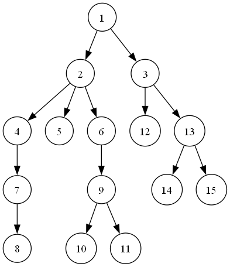
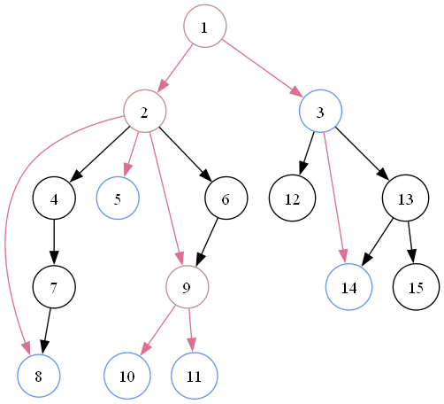

# <center> 虚树 (Virtual Tree) </center>

## <center> 引入 </center>

### [消耗战](https://www.luogu.com.cn/problem/P2495)

有 $n$ 个点的树和 $m$ 次询问，每次询问先给出一个 $k$，然后给出 $k$ 个数，分别为 $h_i,i\in [1,k]$。求将这些给定点与 $1$ 号点分离的代价。这过程中只允许删除边，并且删除 $(u,v)$ 之间的边需要 $w$ 的代价。

$1\le n\le 2.5\times 10^5$，$1\le m\le 5\times 10^5$，$\sum\limits k\le 5\times 10^5$。

### 朴素做法

不妨称每次询问给出的点为 **关键点**，考虑动态规划。

设 $f_u$ 表示隔离以 $u$ 为根节点的子树需要的代价，于是不难得出以下状态转移：

- 如果 $u$ 是关键点，那么删除 $\min\limits_{v\in fa_u}\{(u,v)\}$ 这条边，并加上代价。
- 如果 $u$ 不是关键点，那么获得 $\min\{\min\limits_{v\in fa_u}\{(u,fa_u)\},\sum\limits_{v\in son_u}f_v\}$ 的代价。

但是这样每一次动态规划是 $O(n)$ 的，显然无法满足我们的需要。

注意到 $m$ 与 $k$ 几乎相同的数量级，这就说明 $k$ 在大多数时候相对于 $n$ 来说是极其稀疏的。换句话说，我们在动态规划的时候记录了许多并没有价值和意义的状态。例如我们有树上的链 $u\to\dots\to t\to\dots\to v$，长度为 $500$，但是，只有 $u,v$ 是关键点，那么我们中间记录的 $t$ 就是多余的。

于是，虚树，出现了 $······$

## <center> 虚树 <center>

对于一类需要考虑的点相对于原树很稀疏的、并不需要考虑关键点与关键点之间多余状态的问题，我们可以使用虚树在 $k\log k$ 的复杂度内将问题规模缩小至 $\sum k$ 的数量级，将所需要的状态从原树中提炼出来达到均摊复杂度的目的。

具体地，对于关键点 $h_i,i\in [1,k]$，我们把它们任意两个点的 $lca$ 加入虚树中，同时再把这些 $lca$ 的 $lca$、$lca$ 的 $lca$ 的 $lca$ 加入 $······$ 直到加入所有点的总 $lca$ 就结束。特别地，一般为了方便，我们总加入我们钦定的根节点 $1$ 或者你的 $root$ 进虚树。这随意的加入是因为虚树本来就是化简原树的结构，显然与原树越相似并不会影响其正确性，只需要我们的关键点都在这里面即可。

也即，虚树的点集可以表示为：

$$V=\{v|\sum_{i=1}^m\sum_{j=i+1}^m\epsilon(\operatorname{lca}(p_i,p_j)=v)\}$$

> **复杂度正确性证明**
>
> 找两个节点公共祖先的过程，看起来需要 $n^2 \log n$ 的复杂度。但是我们注意到很多点对的 $\operatorname{lca}$ 是重复的，或者说是不需要被计算的。因此，我们可以给出一种求 $\operatorname{lca}$ 的方式，使得我们至多只计算 $k\log k$ 次就得出虚树的结构。这就需要用到 $\operatorname{dfn}$ 的性质了。
>
> 对于一棵 $n$ 个节点的树，给定关键节点 $\{p_m\}$，我们按照 $\operatorname{dfn}$ 排序，那么显然，刚开始的 $p_1$ 与 $p_2$ 会产生一个 $\operatorname{lca}$，并且 $\operatorname{dfn}$ 相邻还保证了它的路径之上不再会有关键节点。那么，产生的新节点 $p_{m+1}$ 就继续与 $p_3$ 寻找最近公共祖先，这样，我们最多加入 $n-1$ 个点，就保证了虚数复杂度的正确性。

## <center> 实现 </center>

这里我着重介绍单调栈维护链的方法（因为另一个方法没有把院里搞冥摆。

### 二次排序

根据我们的叙述，显然可以得到一个二次排序的做法：

- 将关键点数组 $\{p_k\}$ 按照 $\operatorname{dfn}$ 排序。
- 对于 $\forall i\in[1,k-1]$，将 $\operatorname{lca}(p_i,p_{i+1})$ 加进数组 $p$ 中，然后再次排序、去重，得到长度为 $m$ 的序列。
- 对于 $\forall i\in[1,m-1]$，在 $\operatorname{lca}(p_i,p_{i+1})$ 与 $p_{i+1}$ 之间建一条边。

然后虚树就建完了。

> **正确性证明**
> 
> 第一个排序与随后的处理是我们在 **虚数** 中就已经给过证明了。现在我们证明为什么只需要连边 $(\operatorname{lca}(p_i,p_{i+1}),p_{i+1})$。
>
> 对于 $x,y$，如果 $\operatorname{lca}(x,y)=x$，那么就在 $x\to y$ 建边。其中 $\operatorname{dfn}$ 的排序保证了 $x\to y$ 中间不包含其它关键节点。
>
> 否则，如果 $\operatorname{lca}(x,y)=l$，那么就把 $l$ 当成 $y$ 的祖先，同样 $\operatorname{dfn}$ 保证了路径上2不会有其它关键节点。
>
> 注意到 $y$ 是祖先的情况是不可能出现的。这是因为 $x$ 的 $\operatorname{dfn}$ 比 $y$ 的要小。
>
> 而且，我们将 $p_1$ 钦定成 $1$ 的话，那么显然会有一条 $(1,p_2)$ 的边，然后剩下的就正常连接即可。这显然对于任何一个点都会正确地连接到树上。边一共 $m-1$ 条。

下面举个栗子：



关键节点是：


然后就可以得到需要被加进去的点：


于是现在点集排序后的顺序是：$1,2,8,5,9,10,11,3,14$。

- 对一个点对 $(1,0)$，加入边 $1\to 2$。
- 对第二个点对 $(2,8)$，加入 $2\to 8$。
- 第三个点对 $(8,5)$ 加入 $2\to 5$。

    $\vdots$

- 最后一个点对 $(3,14)$，加入 $3\to 14$。

最后得到虚树：



提取出来就是这个东西：


这就建完了虚树。

### 单调栈法

在单调栈中，里面所有的点构成了虚树上的一条链（其实也是原树上的一条链）。我们不断维护链的过程，在弹出的时候就可以顺带着建立边。

那么问题就变成了如何维护一条链。

首先，我们仍然需要将数组以 $\operatorname{dfn}$ 序进行排序。

我们假设现在单调栈 $s$ 中已经有一条链，并且栈中相邻的两个点之间的路径上不包含关键节点，现在加入一个点 $v$，栈顶元素（也就是链上深度最大的点）为 $u$，那么，我们计算 $l=\operatorname{lca}(u,v)$，然后分类讨论：

- 如果 $l=u$，那么 $v$ 就是 $u$ 的儿子，直接把 $v$ 弹进单调栈中即可。
- 如果 $l\not =u$。此时，显然有 $dfn_l<dfn_u$，但是如果直接在 $l\to u$ 连边却不对。因为我们没有性质保证 $l\to u$ 之间没有关键节点。因此，我们还需要判断 $s_{top-1}$ 的 $\operatorname{dfn}$ 与 $dfn_l$ 的关系。我们记 $f=s_{top-1}$，并做以下判断：
- - 如果 $dfn_f>dfn_l$，也就是说，$f$ 仍然是 $l$ 的儿子，那么显然 $f$ 与 $u$ 之间已经没有关键节点，直接连边 $f\to u$ 即可。然后令 $top-1\to top$，并继续执行这一判断。
- - 否则，$dfn_f< dfn_l$，也就是说，$l$ 是 $f$ 的儿子。那么此时显然需要建立 $l\to s_{top}$ 的边，然后，弹出 $s_{top}$ 并加入 $l$，然后再加入 $v$，跳出循环。
- - 否则，如果 $dfn_f=dfn_l$，也就是说，$l=f$，那么此时就不需要加入 $l$ 的操作，直接加入 $v$ 即可，跳出循环。

这就是单调栈建立虚树的方法。

这个建立虚树的正确性。。。应该也是好证的。在我刚刚的步骤中，每一次加入边时，都加入一句 **根据 $\operatorname{dfn}$ 的性质可知边中不包含其它任何关键节点** 即可。

代码的话就按照我讲的步骤写就行了，建议大家先写然后再对照，能自己调出来先自己调。

~~哦对了，最后别忘清空栈，顺便把栈里面的边都加上。~~

```cpp
sort(h+1,h+1+k,cmp);
tp=0; st[++tp]=1;
for(int i=1;i<=k;++i){
	if(h[i]==1)	continue;
	int lca=callca(h[i],st[tp]);
	if(lca!=st[tp]){
		while(dfn[st[tp-1]]>dfn[lca])	vir[st[tp-1]].pb(st[tp]), --tp;
		if(dfn[st[tp-1]]<dfn[lca])	vir[lca].pb(st[tp]), st[tp]=lca;
		else	vir[lca].pb(st[tp]), --tp;
	}
	st[++tp]=h[i];
}
while(tp>1)	vir[st[tp-1]].pb(st[tp]), --tp;
```

## <center> 回到消耗战

建出虚树之后，我们在虚树上 $dfs$，就可以得到答案。具体地，我们记录一个 $minn$ 表示 $1\to u$ 的路径上边权最小值，$f$ 表示 $u$ 子树内的答案，于是得到转移：

- 如果 $u$ 是关键节点，那么 $f_u=minn_u$。
- 否则，$f_u\min\{\sum\limits_{v\in son_u}f_v,minn_u\}$。

然后输出 $f_1$ 即可。

## 习题选讲

### [共享单车](https://www.luogu.com.cn/problem/P5680)

与 **消耗战** 一样，~~只不过这道题更加侧重于考阅读理解。~~

调侃：P5680 [GZOI2017] 共享单车 |【模板】读题。

### [ygg](https://www.luogu.com.cn/problem/P3233)

这个题也是在虚树上树形 $dp$，主要记录的是树上在所有关键点中，距离关键点 $u$ 最近的点的数量。这里用到了一个小 $\text{trick}$，也即在虚树的一条边上进行倍增。众所周知，虚树上的一条边代表了原树上的一条链，而如果我们知道虚树上的边 $u\to v$，想要找到 $v$ 的在 $u$ 子树内的距离 $u$ 最近的祖先，就可以使用 $dep+$ 倍增实现，和倍增 $lca$ 差不多。

### [树上的毒瘤](https://www.luogu.com.cn/problem/P4242)

题如其名，这题真的很毒瘤。

题目的意思大致是维护一棵树并支持两个操作：

1. 给定点 $u,v$ 和颜色 $col$，把 $u\to v$ 的路径上的点的颜色都改成 $col$。
2. 给定 $m$ 个点 $A=\{a_i\}$，对于每个点 $i$，求：
   $$\sum\limits_{j\in A}T(i,j)$$
   其中 $T(i,j)$ 表示 $i\to j$ 的简单路径上颜色段的数量。例如 $114514$ 含有 $5$ 个颜色段。

最开始会给出树的形态和每个点的初始颜色。并且 $n\le 10^5, \sum m\le 2\times 10^5$。

#### 做法

其实……思路什么的……最好想了。

首先，看到 $\sum m$ 的限制想到虚树，正好该询问与原树上的父子结构关系无关，因此初步确定使用虚树。然后维护点对的路径上颜色段数量，这里树上路径问题不难想到点分治维护，然后我们在建立虚树的时候可以把边权设置为两点之间的颜色段数量，但是询问一条路径上的颜色段数量我们也需要单独维护。容易想到先重链剖分然后使用线段树维护颜色段数量。

具体地，线段树上，我们维护 $lc,rc,sum$ 和 $tag$。其中 $lc,rc$ 分别表示该区间最左段 / 右端的颜色是什么。$sum$ 表示该区间段的颜色段数，$tag$ 记录懒标记。合并时，我们使用左儿子的 $rc$ 匹配右儿子的 $lc$，匹配成功则将 `sum[p<<1]+sum[p<<1|1]-1->sum[p]` 否则 `sum[p<<1]+sum[p<<1|1]->sum[p]`。`push_down` 的时候直接将 $sum$ 置为 $1$ 即可。

特别地，我们需要特殊处理两条重链的交界处的颜色段，如果相同需要将答案 $-1$。但是，在 `caldis` 函数中，我们并不需要可以维护，因为对于 $u\to t\to v$ 的一条边，我们只需要求出 $u\to t$ 的颜色段和 $t\to v$ 的颜色段，求和之后 $-1$ 即可。因为这里 $t$ 这个颜色段无论如何都多算了一遍。在统计答案的时候，设现在点分治的根节点为 $root$，则 $x\to root\to y$ 的路径答案就是 $dis_x+dis_y-1$，也就无需讨论颜色问题。

时间复杂度虚树有一个 $O(\sum m\log m\log n)$，点分治有 $O(n\log^2 n)$。因此总复杂度就是 $O(\sum m \log n(\log nm))$

然后。。。写代码罢，我写了将近 $10Kib$，写的最长的一次。

```cpp
#include<cstdio>
#include<iostream>
#include<cstring>
#include<queue>
#include<stack>
#include<algorithm>
#include<map>
#include<iomanip>
#include<unordered_map>

#include<bitset>
#include<set>

#include<deque>
#include<cassert>
#include<cstdlib>
#include<cmath>
#include<ctime>
#include<vector>
#include<random>

#define int long long
#define fi first
#define se second
#define pb push_back
#define mk make_pair
#define DBG cerr << __LINE__ << ' ' << __FUNCTION__ << endl

#define DRE default_random_engine
#define UID uniform_int_distribution
#define y0 Y0
#define y1 Y1

#define pi acos(-1)
#define eps (1e-8)
#define endl '\n'

using namespace std;

const int INF = 0x3f3f3f3f;
typedef pair<int,int> PII;
typedef pair<int,PII> PIII;
const int N = 2e5 + 10;
const int M = 1e6 + 10;

int n,t,col[N];

namespace seg{
	int lc[N<<2], rc[N<<2], sum[N<<2], tag[N<<2];
	void push_up(int p){
		if(rc[p<<1]==lc[p<<1|1])	sum[p]=sum[p<<1|1]+sum[p<<1]-1;
		else	sum[p]=sum[p<<1|1]+sum[p<<1];
		lc[p]=lc[p<<1], rc[p]=rc[p<<1|1];
	}
	void push_down(int p){
		if(!tag[p])	return ;
		sum[p<<1]=sum[p<<1|1]=1;
		lc[p<<1]=rc[p<<1]=lc[p<<1|1]=rc[p<<1|1]=tag[p];
		tag[p<<1]=tag[p<<1|1]=tag[p];
		tag[p]=0;
		return ;
	}
	void update(int p,int l,int r,int left,int right,int x){
		if(left<=l&&r<=right){
			tag[p]=x, lc[p]=rc[p]=x, sum[p]=1;
			return ;
		}
		push_down(p);
		int mid=l+r>>1;
		if(left<=mid)	update(p<<1,l,mid,left,right,x);
		if(right>mid)	update(p<<1|1,mid+1,r,left,right,x);
		push_up(p);
	}
	PIII query(int p,int l,int r,int left,int right){
		if(left<=l&&r<=right)	return mk(sum[p],mk(lc[p],rc[p]));
		push_down(p);
		int mid=l+r>>1, tls = 0, trs = 0;
		PIII ls, rs;
		if(left<=mid)	tls=1, ls=query(p<<1,l,mid,left,right);
		if(right>mid)	trs=1, rs=query(p<<1|1,mid+1,r,left,right);
		if(!tls)	return rs;
		else if(!trs)	return ls;
		else	return mk(ls.fi+rs.fi-(ls.se.se==rs.se.fi),mk(ls.se.fi,rs.se.se));
	}
}

vector<int> g[N];
namespace cut{
	int dfn[N], rk[N], top[N], siz[N], fa[N][20], dep[N], son[N], idx;
	void dfs1(int x,int fat){
		fa[x][0]=fat, siz[x]=1, dep[x]=dep[fat]+1;
		for(int i=1;i<=t;++i)	fa[x][i]=fa[fa[x][i-1]][i-1];
		for(int y:g[x]){
			if(y==fat)	continue;
			dfs1(y,x);
			siz[x]+=siz[y];
			if(siz[son[x]]<siz[y])	son[x]=y;
		}
	}
	void dfs2(int x,int tp){
		top[x]=tp, dfn[x]=++idx, rk[idx]=x;
		if(son[x])	dfs2(son[x],tp);
		for(int y:g[x])
			if(y!=son[x]&&y!=fa[x][0])	dfs2(y,y);
	}
	void update(int x,int y,int col){
		// cout<<"CUT::UPDATE "<<x<<" "<<y<<" "<<col<<endl;
		while(top[x]!=top[y]){
			if(dep[top[x]]<dep[top[y]])	swap(x,y);
			// cout<<x<<" "<<top[x]<<endl;
			seg::update(1,1,idx,dfn[top[x]],dfn[x],col);
			x=fa[top[x]][0];
		}
		if(dep[x]<dep[y])	swap(x,y);
		// cout<<x<<" "<<y<<endl;
		seg::update(1,1,idx,dfn[y],dfn[x],col);
	}
	PIII query(int x,int y){
		PIII lst, now;
		int ans=0, l=-1;
		while(top[x]!=top[y]){
			if(dep[top[x]]<dep[top[y]])	swap(x,y);
			now=seg::query(1,1,idx,dfn[top[x]],dfn[x]);
			ans+=now.fi-(now.se.se==lst.se.fi);
			lst=now; x=fa[top[x]][0];
			if(l==-1)	l=lst.se.fi;
		}
		if(dep[x]<dep[y])	swap(x,y);
		now=seg::query(1,1,idx,dfn[y],dfn[x]);
		if(l==-1)	l=now.se.fi;
		// cout<<now.fi<<" "<<now.se.fi<<" "<<now.se.se<<endl;
		return mk(ans+now.fi-(now.se.se==lst.se.fi),mk(l,now.se.se));
	}
	int lca(int x,int y){
		while(top[x]!=top[y]){
			if(dep[top[x]]<dep[top[y]])	swap(x,y);
			x=fa[top[x]][0];
		}
		return dep[x]<dep[y]?x:y;
	}
}

int allcol[N<<1], cnt;

struct question{
	int op,u,v,col,k;
	vector<int> p;
}ques[N];

int a[N], k, q, ans[N];
bool tag[N];
namespace Virtree{
	vector<PII> vir[N];
	int st[N], top, cnt;
	bool cmp(int x,int y){ return cut::dfn[x]<cut::dfn[y];}
	void add(int x,int y){
		int w=cut::query(x,y).fi;
		vir[x].pb(mk(y,w)), vir[y].pb(mk(x,w));
	}
	void build(){
		sort(a+1,a+1+k,cmp);
		st[top=1]=1; cnt=1;
		for(int i=1;i<=k;++i){
			if(a[i]==1)	continue;
			int lca=cut::lca(a[i],st[top]);
			if(st[top]!=lca){
				while(cut::dfn[st[top-1]]>cut::dfn[lca])	add(st[top-1],st[top]), --top;
				if(cut::dfn[st[top-1]]<cut::dfn[lca])	add(lca,st[top]), st[top]=lca, ++cnt;
				else	add(lca,st[top]), --top;
			}
			st[++top]=a[i], ++cnt;
		}
		while(top>1)	add(st[top-1],st[top]), --top;
	}
	void init(int x,int fa);
}

namespace PointDevide{
	int maxx[N], siz[N], sum, root;
	bool vis[N];
	void calsiz(int x,int fa){
		maxx[x]=0, siz[x]=1;
		for(PII y:Virtree::vir[x]){
			if(vis[y.fi]||y.fi==fa)	continue;
			calsiz(y.fi,x);
			siz[x]+=siz[y.fi];
			maxx[x]=max(maxx[x],siz[y.fi]);
		}
		maxx[x]=max(maxx[x],sum-siz[x]);
		if(maxx[x]<maxx[root])	root=x;
	}
	vector<int> v, key, sub;
	int dis[N];
	int closest[N];
	int subs, cols[N], subtot, coltot[N];
	void caldis(int x,int fa){
		v.pb(x);
		if(tag[x])	key.pb(x), sub.pb(x);
		for(PII y:Virtree::vir[x]){
			if(vis[y.fi]||y.fi==fa)	continue;
			closest[y.fi]=closest[x];
			dis[y.fi]=dis[x]+y.se-1;
			caldis(y.fi,x);
		}
	}
	void dfz(int x){
		vis[x]=true;
		for(PII y:Virtree::vir[x]){
			if(vis[y.fi])	continue;
			dis[y.fi]=y.se; key.clear(); closest[y.fi]=y.fi;
			int coly = closest[y.fi];
			caldis(y.fi,x);
			for(int z:key)	cols[coly]+=dis[z], ++coltot[coly], subs+=dis[z], ++subtot;
		}
		for(int y:sub){
			int coly=closest[y];
			ans[y]+=(subtot-coltot[coly])*(dis[y]-1)+(subs-cols[coly]);
		}
		if(tag[x]){
			ans[x]+=subs;
			for(int y:sub)	ans[y]+=dis[y];
		}
		
		for(int y:v)
			cols[closest[y]]=coltot[closest[y]]=0, dis[y]=closest[y]=0;
		v.clear(); key.clear(); sub.clear();
		subs=subtot=0;
		for(PII y:Virtree::vir[x]){
			if(vis[y.fi])	continue;
			maxx[root=0]=INF, sum=siz[y.fi];
			calsiz(y.fi,-1), calsiz(root,-1);
			dfz(root);
		}
	}
}

void Virtree::init(int x,int fa){
	for(PII y:vir[x])
		if(y.fi!=fa)	init(y.fi,x);
	vir[x].clear(), tag[x]=false, ans[x]=0;
	PointDevide::vis[x]=false;
}

signed main(){
	ios::sync_with_stdio(false);
	cin.tie(0), cout.tie(0);
	cin>>n>>q; t=log(n)/log(2);
	for(int i=1;i<=n;++i)	cin>>col[i], allcol[++cnt]=col[i];
	for(int i=1,x,y;i<n;++i)	cin>>x>>y, g[x].pb(y), g[y].pb(x);
	for(int i=1;i<=q;++i){
		cin>>ques[i].op;
		if(ques[i].op==1)	cin>>ques[i].u>>ques[i].v>>ques[i].col, allcol[++cnt]=ques[i].col;
		else{
			cin>>ques[i].k;
			for(int j=1,x;j<=ques[i].k;++j)	cin>>x, ques[i].p.pb(x);
		}
	}

	sort(allcol+1, allcol+1+cnt);
	cnt=unique(allcol+1,allcol+1+cnt)-allcol-1;
	for(int i=1;i<=n;++i)	col[i]=lower_bound(allcol+1,allcol+1+cnt,col[i])-allcol;
	for(int i=1;i<=q;++i)
		if(ques[i].op==1)	ques[i].col=lower_bound(allcol+1,allcol+1+cnt, ques[i].col)-allcol;
	cut::dfs1(1,0), cut::dfs2(1,1);
	for(int i=1;i<=n;++i)
		seg::update(1,1,cut::idx,cut::dfn[i],cut::dfn[i],col[i]);
	for(int i=1;i<=q;++i){
		if(ques[i].op==1)	cut::update(ques[i].u,ques[i].v,ques[i].col);
		else{
			Virtree::init(1,0);
			int tot=0; k=ques[i].k;
			for(int x:ques[i].p)	tag[x]=true, a[++tot]=x;
			Virtree::build();
			PointDevide::maxx[PointDevide::root=0]=INF, PointDevide::sum=Virtree::cnt;
			PointDevide::calsiz(1,-1), PointDevide::calsiz(PointDevide::root,-1);
			PointDevide::dfz(PointDevide::root);
			for(int x:ques[i].p)
				cout<<ans[x]+1<<" ";
			cout<<endl;
		}
	}
	return 0;
}
```
