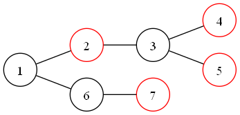
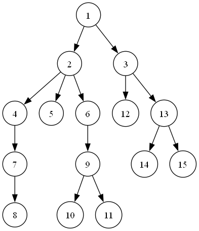

# <center> 虚树 (Virtual Tree) </center>

## <center> 引入 </center>

### [消耗战](https://www.luogu.com.cn/problem/P2495)

有 $n$ 个点的树和 $m$ 次询问，每次询问先给出一个 $k$，然后给出 $k$ 个数，分别为 $h_i,i\in [1,k]$。求将这些给定点与 $1$ 号点分离的代价。这过程中只允许删除边，并且删除 $(u,v)$ 之间的边需要 $w$ 的代价。

$1\le n\le 2.5\times 10^5$，$1\le m\le 5\times 10^5$，$\sum\limits k\le 5\times 10^5$。

### 朴素做法

不妨称每次询问给出的点为 **关键点**，考虑动态规划。

设 $f_u$ 表示隔离以 $u$ 为根节点的子树需要的代价，于是不难得出以下状态转移：

- 如果 $u$ 是关键点，那么删除 $\min\limits_{v\in fa_u}\{(u,v)\}$ 这条边，并加上代价。
- 如果 $u$ 不是关键点，那么获得 $\min\{\min\limits_{v\in fa_u}\{(u,fa_u)\},\sum\limits_{v\in son_u}f_v\}$ 的代价。

但是这样每一次动态规划是 $O(n)$ 的，显然无法满足我们的需要。

注意到 $m$ 与 $k$ 几乎相同的数量级，这就说明 $k$ 在大多数时候相对于 $n$ 来说是极其稀疏的。换句话说，我们在动态规划的时候记录了许多并没有价值和意义的状态。例如我们有树上的链 $u\to\dots\to t\to\dots\to v$，长度为 $500$，但是，只有 $u,v$ 是关键点，那么我们中间记录的 $t$ 就是多余的。

于是，虚树，出现了 $······$

## <center> 虚树 <center>

对于一类需要考虑的点相对于原树很稀疏的、并不需要考虑关键点与关键点之间多余状态的问题，我们可以使用虚树在 $k\log k$ 的复杂度内将问题规模缩小至 $\sum k$ 的数量级，将所需要的状态从原树中提炼出来达到均摊复杂度的目的。

具体地，对于关键点 $h_i,i\in [1,k]$，我们把它们任意两个点的 $lca$ 加入虚树中，同时再把这些 $lca$ 的 $lca$、$lca$ 的 $lca$ 的 $lca$ 加入 $······$ 直到加入所有点的总 $lca$ 就结束。特别地，一般为了方便，我们总加入我们钦定的根节点 $1$ 或者你的 $root$ 进虚树。这随意的加入是因为虚树本来就是化简原树的结构，显然与原树越相似并不会影响其正确性，只需要我们的关键点都在这里面即可。

但是这看起来很不好实现，因为找 $lca$ 容易，但是按照刚刚的描述方法我们似乎需要加入 $k^2$ 次 $lca$，这显然不能被接受。因此，我们有以下两种快速的建虚树的方法，并且每一种都使用到了 $dfs$ 序的性质，这里我们补充一下：

> **dfn 的性质**
> 
> 如果我们按照从左往右的顺序遍历整棵树，那么它的 $dfn$ 总体趋势也是从左往右（~~废话~~），因而，它们的 $lca$ 也是近似从左往右的顺序。大家自行感性理解，下面会用到。

## <center> 实现 </center>

这里我着重介绍单调栈维护链的方法（因为另一个方法没有把院里搞冥摆。

### 二次排序

我们对于 $h$ 数组按照 $dfn$ 排序，然后求出 $lca_i=\operatorname{lca}(h_i,h_{i+1})$，存入数组 $h$ 之中，进行去重操作一遍，即重新排序并且把相邻的节点的 $lca$ 存入最后的点集中即可。

### 单调栈

> **Warning**
>
> 注意，这里的 **单调** 表示的是深度单调。

这里的做法仍然是先按照 $dfn$ 进行排序，然后再单调栈上不断维护一条从根到树上某一个节点的一条路径，在此基础之上进行建边操作。



如图，假设 $2，,4,5,7$ 为关键节点，并且 $dfn$ 排序之后顺序为 $2,5,4,7$。于是，开始循环：

1. 首先将 $1$ 加入栈中，因为我们需要一个固定的根来帮助我们完成一些任务，因此每次加入 $1$ 会方便一些，但是，这也许要根据现实情况斟酌考虑。
2. 遍历 $a_i$，求出 $l=\operatorname{lca}(a_i,st_{top})$，如果 $l$ 就是当前栈顶 $st_{top}$，则跳到第 $4$ 步，否则进入步骤 $3$。
3. - 如果 `dfn[st[top-1]]>dfn[l]` 则说明当前栈顶的深度还比 $l$ 高，也即当前的 $a_i$ 与栈顶 $st_{top}$ 并不在一条链上，于是弹出 $st_{top}$ 并且加入一条 $st_{top-1}\to st_{top}$ 的边，重复 $3.1$ 判断。
   - 过程 $3.1$ 完成后，如果 `dfn[st[top-1]]<dfn[l]`，则说明 $l$ 是以前没有入过栈的新节点，我们需要将它单独入栈并且建立一条 $l\to st_{top}$ 的边，并将 $st_{top}$ 出栈。
   - 过程 $3.1$ 完成后，如果 `dfn[st[top-1]]==dfn[l]`，则说明 $l$ 就是当前 $a_i$ 与刚开始栈顶的最近公共祖先，并且之前已经入过栈，因此只需要建立 $l\to st_{top}$ 的边并且弹出栈顶元素即可。
4. 将 $a_i$ 弹入栈中，并且继续遍历。
5. 结束后将栈内残留元素弹出并且对于 $i\in [2,top]$ 建立一条 $st_{i-1}\to st_{i}$ 的边。

抽象地，我们可以这样画出流程图：

（~~我用 $dot$ 画的，不知道怎么控制方向，所以有点奇怪~~（逃）



## 习题选讲

### [消耗战](https://www.luogu.com.cn/problem/P2495)

就是引入部分的题目。

这个题建出来虚树之后，显然可以在树上 $dp$。我们设 $f_u$ 表示虚树上点 $u$ 子树内完全与 $1$ 分离需要的最小代价，那么，设 $s=\sum\limits_{v\in son_u}f_v$，则有：

- 如果 $u$ 是供给点，则 $f_u=minn$。
- 否则，$f_u=\min\{s,minn\}$。

其中 $minn$ 表示 $u$ 到根节点的最小边权。

然后就做完了。

```cpp
int n, q;
vector<PII> g[N];
int minn[N], dfn[N], idx, top[N], siz[N], son[N], fa[N], dep[N];
int st[N], tp;
bool require[N];
vector<int> vir[N];

void dfs1(int x,int fat){
	fa[x]=fat; siz[x]=1, dep[x]=dep[fat]+1;
	for(auto y:g[x]){
		int v=y.fi, z=y.se;
		if(v==fat)	continue;
		minn[v]=min(z,minn[x]);
		dfs1(v,x);
		siz[x]+=siz[v];
		if(siz[son[x]]<siz[v])	son[x]=v;
	}
}
void dfs2(int x,int tp){
	top[x]=tp; dfn[x]=++idx;
	if(son[x])	dfs2(son[x],tp);
	for(auto y:g[x])
		if(y.fi!=son[x]&&y.fi!=fa[x])	dfs2(y.fi,y.fi);
}
int callca(int x,int y){
	while(top[x]!=top[y]){
		if(dep[top[x]]<dep[top[y]])	swap(x,y);
		x=fa[top[x]];
	}
	return dep[x]<dep[y]?x:y;
}

int k,h[N];
bool cmp(int x,int y){ return dfn[x]<dfn[y]; }

int dfs3(int x){
	int sum=0, ans;
	for(int y:vir[x])	sum+=dfs3(y);
	if(x==1)	return require[x]=false, vir[x].clear(), sum;
	if(require[x])	ans=minn[x];
	else	ans=min(sum,minn[x]);
	require[x]=false, vir[x].clear();
	return ans;
}

signed main(){
	ios::sync_with_stdio(false);
	cin.tie(0), cout.tie(0);
	cin>>n;
	for(int i=1,x,y,z;i<n;++i)	cin>>x>>y>>z, g[x].pb(mk(y,z)), g[y].pb(mk(x,z));
	minn[1]=INF; dfs1(1,0), dfs2(1,1); minn[1]=0;
	cin>>q;
	while(q--){
		cin>>k;
		for(int i=1;i<=k;++i)	cin>>h[i], require[h[i]]=true;
		sort(h+1,h+1+k,cmp);
		tp=0; st[++tp]=1;
		for(int i=1;i<=k;++i){
			if(h[i]==1)	continue;
			int lca=callca(h[i],st[tp]);
			if(lca!=st[tp]){
				while(dfn[st[tp-1]]>dfn[lca])	vir[st[tp-1]].pb(st[tp]), --tp;
				if(dfn[st[tp-1]]<dfn[lca])	vir[lca].pb(st[tp]), st[tp]=lca;
				else	vir[lca].pb(st[tp]), --tp;
			}
			st[++tp]=h[i];
		}
		while(tp>1)	vir[st[tp-1]].pb(st[tp]), --tp;
		cout<<dfs3(1)<<endl;
	}
	return 0;
}
```

值得注意的是，这些东西做完之后每次还需要清空虚树，而且必须精准清空，因此我们可以额外写一个 $dfs$ 函数一遍遍历一遍清空，也可以在处理答案的时候就把数组清空。

### [共享单车](https://www.luogu.com.cn/problem/P5680)

与 **消耗战** 一样，~~只不过这道题更加侧重于考阅读理解。~~

调侃：P5680 [GZOI2017] 共享单车 |【模板】读题。

### [ygg](https://www.luogu.com.cn/problem/P3233)

这个题也是在虚树上树形 $dp$，主要记录的是树上在所有关键点中，距离关键点 $u$ 最近的点的数量。这里用到了一个小 $\text{trick}$，也即在虚树的一条边上进行倍增。众所周知，虚树上的一条边代表了原树上的一条链，而如果我们知道虚树上的边 $u\to v$，想要找到 $v$ 的在 $u$ 子树内的距离 $u$ 最近的祖先，就可以使用 $dep+$ 倍增实现，和倍增 $lca$ 差不多。

### [树上的毒瘤](https://www.luogu.com.cn/problem/P4242)

题如其名，这题真的很毒瘤。

题目的意思大致是维护一棵树并支持两个操作：

1. 给定点 $u,v$ 和颜色 $col$，把 $u\to v$ 的路径上的点的颜色都改成 $col$。
2. 给定 $m$ 个点 $A=\{a_i\}$，对于每个点 $i$，求：
   $$\sum\limits_{j\in A}T(i,j)$$
   其中 $T(i,j)$ 表示 $i\to j$ 的简单路径上颜色段的数量。例如 $114514$ 含有 $5$ 个颜色段。

最开始会给出树的形态和每个点的初始颜色。并且 $n\le 10^5, \sum m\le 2\times 10^5$。

#### 做法

其实……思路什么的……最好想了。

首先，看到 $\sum m$ 的限制想到虚树，正好该询问与原树上的父子结构关系无关，因此初步确定使用虚树。然后维护点对的路径上颜色段数量，这里树上路径问题不难想到点分治维护，然后我们在建立虚树的时候可以把边权设置为两点之间的颜色段数量，但是询问一条路径上的颜色段数量我们也需要单独维护。容易想到先重链剖分然后使用线段树维护颜色段数量。

具体地，线段树上，我们维护 $lc,rc,sum$ 和 $tag$。其中 $lc,rc$ 分别表示该区间最左段 / 右端的颜色是什么。$sum$ 表示该区间段的颜色段数，$tag$ 记录懒标记。合并时，我们使用左儿子的 $rc$ 匹配右儿子的 $lc$，匹配成功则将 `sum[p<<1]+sum[p<<1|1]-1->sum[p]` 否则 `sum[p<<1]+sum[p<<1|1]->sum[p]`。`push_down` 的时候直接将 $sum$ 置为 $1$ 即可。

特别地，我们需要特殊处理两条重链的交界处的颜色段，如果相同需要将答案 $-1$。但是，在 `caldis` 函数中，我们并不需要可以维护，因为对于 $u\to t\to v$ 的一条边，我们只需要求出 $u\to t$ 的颜色段和 $t\to v$ 的颜色段，求和之后 $-1$ 即可。因为这里 $t$ 这个颜色段无论如何都多算了一遍。在统计答案的时候，设现在点分治的根节点为 $root$，则 $x\to root\to y$ 的路径答案就是 $dis_x+dis_y-1$，也就无需讨论颜色问题。

时间复杂度虚树有一个 $O(\sum m\log m\log n)$，点分治有 $O(n\log^2 n)$。因此总复杂度就是 $O(\sum m \log n(\log nm))$

然后。。。写代码罢，我写了将近 $10Kib$，写的最长的一次。

```cpp
#include<cstdio>
#include<iostream>
#include<cstring>
#include<queue>
#include<stack>
#include<algorithm>
#include<map>
#include<iomanip>
#include<unordered_map>

#include<bitset>
#include<set>

#include<deque>
#include<cassert>
#include<cstdlib>
#include<cmath>
#include<ctime>
#include<vector>
#include<random>

#define int long long
#define fi first
#define se second
#define pb push_back
#define mk make_pair
#define DBG cerr << __LINE__ << ' ' << __FUNCTION__ << endl

#define DRE default_random_engine
#define UID uniform_int_distribution
#define y0 Y0
#define y1 Y1

#define pi acos(-1)
#define eps (1e-8)
#define endl '\n'

using namespace std;

const int INF = 0x3f3f3f3f;
typedef pair<int,int> PII;
typedef pair<int,PII> PIII;
const int N = 2e5 + 10;
const int M = 1e6 + 10;

int n,t,col[N];

namespace seg{
	int lc[N<<2], rc[N<<2], sum[N<<2], tag[N<<2];
	void push_up(int p){
		if(rc[p<<1]==lc[p<<1|1])	sum[p]=sum[p<<1|1]+sum[p<<1]-1;
		else	sum[p]=sum[p<<1|1]+sum[p<<1];
		lc[p]=lc[p<<1], rc[p]=rc[p<<1|1];
	}
	void push_down(int p){
		if(!tag[p])	return ;
		sum[p<<1]=sum[p<<1|1]=1;
		lc[p<<1]=rc[p<<1]=lc[p<<1|1]=rc[p<<1|1]=tag[p];
		tag[p<<1]=tag[p<<1|1]=tag[p];
		tag[p]=0;
		return ;
	}
	void update(int p,int l,int r,int left,int right,int x){
		if(left<=l&&r<=right){
			tag[p]=x, lc[p]=rc[p]=x, sum[p]=1;
			return ;
		}
		push_down(p);
		int mid=l+r>>1;
		if(left<=mid)	update(p<<1,l,mid,left,right,x);
		if(right>mid)	update(p<<1|1,mid+1,r,left,right,x);
		push_up(p);
	}
	PIII query(int p,int l,int r,int left,int right){
		if(left<=l&&r<=right)	return mk(sum[p],mk(lc[p],rc[p]));
		push_down(p);
		int mid=l+r>>1, tls = 0, trs = 0;
		PIII ls, rs;
		if(left<=mid)	tls=1, ls=query(p<<1,l,mid,left,right);
		if(right>mid)	trs=1, rs=query(p<<1|1,mid+1,r,left,right);
		if(!tls)	return rs;
		else if(!trs)	return ls;
		else	return mk(ls.fi+rs.fi-(ls.se.se==rs.se.fi),mk(ls.se.fi,rs.se.se));
	}
}

vector<int> g[N];
namespace cut{
	int dfn[N], rk[N], top[N], siz[N], fa[N][20], dep[N], son[N], idx;
	void dfs1(int x,int fat){
		fa[x][0]=fat, siz[x]=1, dep[x]=dep[fat]+1;
		for(int i=1;i<=t;++i)	fa[x][i]=fa[fa[x][i-1]][i-1];
		for(int y:g[x]){
			if(y==fat)	continue;
			dfs1(y,x);
			siz[x]+=siz[y];
			if(siz[son[x]]<siz[y])	son[x]=y;
		}
	}
	void dfs2(int x,int tp){
		top[x]=tp, dfn[x]=++idx, rk[idx]=x;
		if(son[x])	dfs2(son[x],tp);
		for(int y:g[x])
			if(y!=son[x]&&y!=fa[x][0])	dfs2(y,y);
	}
	void update(int x,int y,int col){
		// cout<<"CUT::UPDATE "<<x<<" "<<y<<" "<<col<<endl;
		while(top[x]!=top[y]){
			if(dep[top[x]]<dep[top[y]])	swap(x,y);
			// cout<<x<<" "<<top[x]<<endl;
			seg::update(1,1,idx,dfn[top[x]],dfn[x],col);
			x=fa[top[x]][0];
		}
		if(dep[x]<dep[y])	swap(x,y);
		// cout<<x<<" "<<y<<endl;
		seg::update(1,1,idx,dfn[y],dfn[x],col);
	}
	PIII query(int x,int y){
		PIII lst, now;
		int ans=0, l=-1;
		while(top[x]!=top[y]){
			if(dep[top[x]]<dep[top[y]])	swap(x,y);
			now=seg::query(1,1,idx,dfn[top[x]],dfn[x]);
			ans+=now.fi-(now.se.se==lst.se.fi);
			lst=now; x=fa[top[x]][0];
			if(l==-1)	l=lst.se.fi;
		}
		if(dep[x]<dep[y])	swap(x,y);
		now=seg::query(1,1,idx,dfn[y],dfn[x]);
		if(l==-1)	l=now.se.fi;
		// cout<<now.fi<<" "<<now.se.fi<<" "<<now.se.se<<endl;
		return mk(ans+now.fi-(now.se.se==lst.se.fi),mk(l,now.se.se));
	}
	int lca(int x,int y){
		while(top[x]!=top[y]){
			if(dep[top[x]]<dep[top[y]])	swap(x,y);
			x=fa[top[x]][0];
		}
		return dep[x]<dep[y]?x:y;
	}
}

int allcol[N<<1], cnt;

struct question{
	int op,u,v,col,k;
	vector<int> p;
}ques[N];

int a[N], k, q, ans[N];
bool tag[N];
namespace Virtree{
	vector<PII> vir[N];
	int st[N], top, cnt;
	bool cmp(int x,int y){ return cut::dfn[x]<cut::dfn[y];}
	void add(int x,int y){
		int w=cut::query(x,y).fi;
		vir[x].pb(mk(y,w)), vir[y].pb(mk(x,w));
	}
	void build(){
		sort(a+1,a+1+k,cmp);
		st[top=1]=1; cnt=1;
		for(int i=1;i<=k;++i){
			if(a[i]==1)	continue;
			int lca=cut::lca(a[i],st[top]);
			if(st[top]!=lca){
				while(cut::dfn[st[top-1]]>cut::dfn[lca])	add(st[top-1],st[top]), --top;
				if(cut::dfn[st[top-1]]<cut::dfn[lca])	add(lca,st[top]), st[top]=lca, ++cnt;
				else	add(lca,st[top]), --top;
			}
			st[++top]=a[i], ++cnt;
		}
		while(top>1)	add(st[top-1],st[top]), --top;
	}
	void init(int x,int fa);
}

namespace PointDevide{
	int maxx[N], siz[N], sum, root;
	bool vis[N];
	void calsiz(int x,int fa){
		maxx[x]=0, siz[x]=1;
		for(PII y:Virtree::vir[x]){
			if(vis[y.fi]||y.fi==fa)	continue;
			calsiz(y.fi,x);
			siz[x]+=siz[y.fi];
			maxx[x]=max(maxx[x],siz[y.fi]);
		}
		maxx[x]=max(maxx[x],sum-siz[x]);
		if(maxx[x]<maxx[root])	root=x;
	}
	vector<int> v, key, sub;
	int dis[N];
	int closest[N];
	int subs, cols[N], subtot, coltot[N];
	void caldis(int x,int fa){
		v.pb(x);
		if(tag[x])	key.pb(x), sub.pb(x);
		for(PII y:Virtree::vir[x]){
			if(vis[y.fi]||y.fi==fa)	continue;
			closest[y.fi]=closest[x];
			dis[y.fi]=dis[x]+y.se-1;
			caldis(y.fi,x);
		}
	}
	void dfz(int x){
		vis[x]=true;
		for(PII y:Virtree::vir[x]){
			if(vis[y.fi])	continue;
			dis[y.fi]=y.se; key.clear(); closest[y.fi]=y.fi;
			int coly = closest[y.fi];
			caldis(y.fi,x);
			for(int z:key)	cols[coly]+=dis[z], ++coltot[coly], subs+=dis[z], ++subtot;
		}
		for(int y:sub){
			int coly=closest[y];
			ans[y]+=(subtot-coltot[coly])*(dis[y]-1)+(subs-cols[coly]);
		}
		if(tag[x]){
			ans[x]+=subs;
			for(int y:sub)	ans[y]+=dis[y];
		}
		
		for(int y:v)
			cols[closest[y]]=coltot[closest[y]]=0, dis[y]=closest[y]=0;
		v.clear(); key.clear(); sub.clear();
		subs=subtot=0;
		for(PII y:Virtree::vir[x]){
			if(vis[y.fi])	continue;
			maxx[root=0]=INF, sum=siz[y.fi];
			calsiz(y.fi,-1), calsiz(root,-1);
			dfz(root);
		}
	}
}

void Virtree::init(int x,int fa){
	for(PII y:vir[x])
		if(y.fi!=fa)	init(y.fi,x);
	vir[x].clear(), tag[x]=false, ans[x]=0;
	PointDevide::vis[x]=false;
}

signed main(){
	ios::sync_with_stdio(false);
	cin.tie(0), cout.tie(0);
	cin>>n>>q; t=log(n)/log(2);
	for(int i=1;i<=n;++i)	cin>>col[i], allcol[++cnt]=col[i];
	for(int i=1,x,y;i<n;++i)	cin>>x>>y, g[x].pb(y), g[y].pb(x);
	for(int i=1;i<=q;++i){
		cin>>ques[i].op;
		if(ques[i].op==1)	cin>>ques[i].u>>ques[i].v>>ques[i].col, allcol[++cnt]=ques[i].col;
		else{
			cin>>ques[i].k;
			for(int j=1,x;j<=ques[i].k;++j)	cin>>x, ques[i].p.pb(x);
		}
	}

	sort(allcol+1, allcol+1+cnt);
	cnt=unique(allcol+1,allcol+1+cnt)-allcol-1;
	for(int i=1;i<=n;++i)	col[i]=lower_bound(allcol+1,allcol+1+cnt,col[i])-allcol;
	for(int i=1;i<=q;++i)
		if(ques[i].op==1)	ques[i].col=lower_bound(allcol+1,allcol+1+cnt, ques[i].col)-allcol;
	cut::dfs1(1,0), cut::dfs2(1,1);
	for(int i=1;i<=n;++i)
		seg::update(1,1,cut::idx,cut::dfn[i],cut::dfn[i],col[i]);
	for(int i=1;i<=q;++i){
		if(ques[i].op==1)	cut::update(ques[i].u,ques[i].v,ques[i].col);
		else{
			Virtree::init(1,0);
			int tot=0; k=ques[i].k;
			for(int x:ques[i].p)	tag[x]=true, a[++tot]=x;
			Virtree::build();
			PointDevide::maxx[PointDevide::root=0]=INF, PointDevide::sum=Virtree::cnt;
			PointDevide::calsiz(1,-1), PointDevide::calsiz(PointDevide::root,-1);
			PointDevide::dfz(PointDevide::root);
			for(int x:ques[i].p)
				cout<<ans[x]+1<<" ";
			cout<<endl;
		}
	}
	return 0;
}
```
