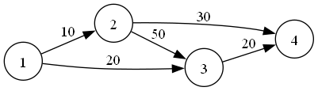
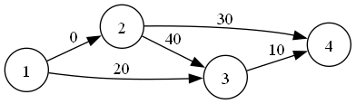
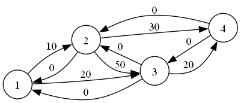
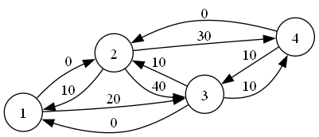
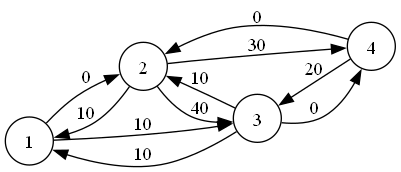
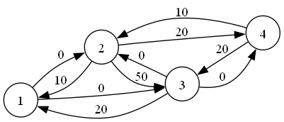

# 网络流

## 基本概念

我们现在有一张图 $G=\{V,E\}$，对于每一条边 $e\in E$，我们用 $(u,v,w)$ 来描述它，分别代表起点，终点和边权；并且这张图上有一个起点 $s$ 和一个终点 $t$，那么我们就可以称这个图是一张 **网络**。

另外的，对于这个起点 $s$，我们称之为 **源点**，对于终点 $t$，我们称之为 **汇点**。下面讲网络流几个基本概念。

### 弧

对于每一条边 $e=(u,v,w)\in E$，我们称之为 **弧**。而这里的 $w$ 被称为这条弧的容量。

### 流

对于一条 $u\to \dots \to v$ 的简单路径，我们称这是这张网络的一个 **流**。它满足以下性质：

- 对于流 $v_1\to\dots\to v_n$，它的大小必须小于等于 $\min\limits_{i=1}^{n-1}\{w_{(v_i,v_{i+1})}\}$。也就是说，流的大小小于等于路径上所有容量的最小值。
- 对于除源点和汇点之外的所有节点，总满足流进总流量等于流出总流量。

对于一张网络，我们希望给定一个确定的流，使得汇点的流量最大，这个问题叫做 **最大流问题**。

### 割

对于一个网络 $G=(V,E)$，我们将集合 $V$ 分成两份，变成 $S$ 和 $T$，其中 $s\in S,t\in T$，并且满足 $S\cup T=V,S\cap T=\emptyset$，则称这一种划分方式是这个网络的一个 **割**。而 **最小割问题** 就是希望找到一个割，使得 $\sum\limits_{u\in S,v\in T}w_{u,v}$ 最小。

### 残余网络

对于一个网络，如果我们已经在这张网络上进行了流的操作，则称流之后的网络为 **残余网络**。

## 最大流

### FF算法 (Ford-Fulkerson)

算法的基本思路是，对于一张残余网络，我们总找到一条 **增广路** 使得总流量增加。而对于顺序不对的情况，我们使用反向边来实现 **反悔** 的操作。

> #### 增广路
>
> 对于一个流 $f=(s\to\dots\to t)>0$，则我们称这个流 $f$ 是该网络的一条增广路。简单来说，就是使总流量增加的路径。

于是找增广路就非常好实现，我们主要来看看怎么实现 **反悔** 操作。

如图网络。显然，对于这张网络，最大流就是 $10+20=30$，但是如果我们先流 $1\to 2\to 3\to 4$ 这一条路径，那么残余网络就变成：

然后流完 $(1\to 3\to 4)$ 之后就没了，得出来的最大流变成了 $20$。显然，这是我们流的顺序不当导致的。如何避免这种情况呢？我们考虑在每一条单向边顺带着连一条反边。如图：

由图可知，这些 **反边** 的容量初始是 $0$，额外的，我们在进行增广的时候，我们在减小正向边容量的同时增大反向边容量，比如对路径 $(1\to 2\to 3\to 4)$ 进行增广后，得到图：

可以看到，我们在进行一次增广之后，把反向边都加上了流量大小的容量，这就是接下来我们实施 **反悔** 操作的重要步骤。进行这一步操作之后，我们继续跑网络流，比如 $(1\to 3\to 4)$：

然后，我们惊奇的发现，这张图竟然还可以进行增广操作，也就是 $(1\to 3\to 2\to 4)$ 这一条增广路。于是增广之后，我们得到下图：

于是，我们这样得到的最大流就是 $30$。

对比原图，我们发现这个图的最终结果和直接增广 $(1,2,4)$ 和 $(1,3,4)$ 两条路径没有任何区别。也就是说，我们通过反悔操作，把我们以前的流不优时再流回去，实际上并不会对答案造成影响。这样，我们就把 $\text{FF}$ 算法学完了。
