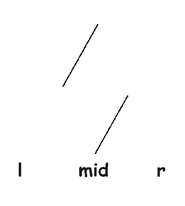
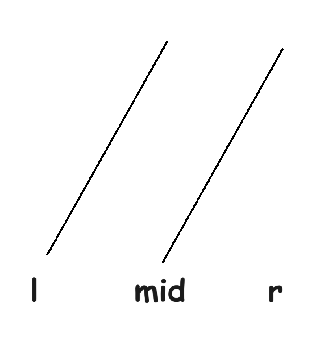
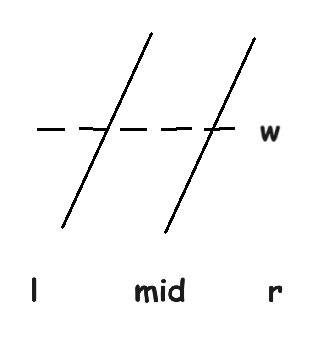
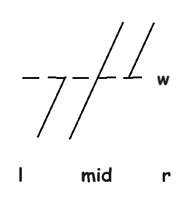

# 
 暑假 $\text{Day 26}$ 模拟赛题解 

## A. Construct

考虑动态规划。

设 $f_i$ 表示最大面值为 $i$ 时的最小需要的纸币数量。然后考虑转移。

这里使用刷表做法。枚举 $j\in[2, \infty)$，表示 $i\times j\leftarrow i$。考虑原来需要 $j$ 个 $i$ 面值的纸币现在可以用一张 $i*j$ 面值的纸币。于是我们遍历原序列，显然，我们需要 $\left\lfloor\frac{a_i}{i}\right\rfloor$ 张 $i$ 面值的货币，因此我们可以省下来 $(j-1)\times \left\lfloor\frac{a_i}{i}\right\rfloor$ 张纸币。于是有方程式：

$$f_{i\times j}\leftarrow f_i - (j-1)\times \left\lfloor\frac{a_i}{i}\right\rfloor$$

## B. Information

首先，对于一个操作序列 $A$，如果我们将 $A$ 翻转，然后对操作完的序列进行翻转后的操作，就会发现序列变回了操作前的序列。也即，对于一个操作 $[l,r]$，如果我们队一个序列使用两边，就相当于没用。

这样，我们只需要求出 $A$ 序列变为 $1,2,\dots,n$ 的操作序列和 $B$ 序列变为 $1,2,\dots,n$ 的操作序列，然后将后者翻转即可由 $A$ 序列得到 $B$ 序列。

然后考虑怎么使得一个序列变得有序，一个很重要的操作是翻转一个序列。

这很容易，我们只需要对于每一个区间 $(l,r),l-L = R-r$ 进行操作即可，这需要 $O(n)$ 的复杂度。

然后，我们考虑对于两个已经有序的且左端最小值大于等于右端最大值的序列如何合并。

显然，对于这样的情况我们可以先分别将两个序列翻转，合并为一个序列之后再翻转回来。

进而，我们考虑如何合并两个有序的区间。

我们可以再将这个区间再进行拆分：

然后我们发现，如果我们取左边的上半段和右边的下半段，就有一个和刚刚一样的没有值域相交的区间了。

然后我们合并这个区间，得到一个新的序列：

然后我们又发现得到了两个新的跟原来一样的两个小的区间。重复上述操作即可。

于是考虑如何得到我们想要的两个排好序的序列。发现我们只需要在最开始的时候进行分治，然后像归并排序一样不断合并区间即可。

复杂度分析：对于区间 $[l,r]$，我们需要先按照下标分治再按照值域分治，而对下标分治下去之后仍然需要对值域分治。于是有：$T(n) = 2T(\frac{n}{2})+S(n)$。

其中 $S(n)=2S(\frac{n}{2})+O(n)=O(n\log n)$。

因此 $T(n)=2T(\frac{n}{2})+n\log n= n\log^2 n$。

## C. Card

这个题是个结论题。

即，在没有标记到的节点任意选点染色，然后染色之后暴力标记，选出来的点一定不超过 $k$ 个，并且时间复杂度 $O(m)$。

> 证明：
>
> **不超过 $k$ 个**：
>
> 首先，对于原图，我们知道，对于任意一个点 $x$，总存在 $i\in [1,k]$ 使得 $\operatorname{dis}(x,p_i)=1$ 或 $x=p_i$。
>
> \- 如果 $\operatorname{dis}(x,p_i)=1$，则我们在这里标记一定会在距离为 $1$ 的地方标记到 $p_i$，进而标记 $p_i$ 原来标记到的点。这样显然不劣。
>
> \- 如果 $x=p_i$，那么同样地，$x$ 可以标记到 $p_i$ 原来标记得到和一些原来标记不到的点，因此也是不劣的。
>
> 又，对于每一个新标记的点，至少会覆盖到一个 $p_i$ 使得之后不需要再标记。因此新的标记的点的数量总不超过 $k$。
>
> 于是我们就可以遍历 $1-n$，遇到没有标记的就标记一下。但是注意要遍历所有的两个距离之内能够到达的点，否则可能会因为标记卡住了而无法继续标记新的节点。
>
> **复杂度正确性：**
>
> 我们考虑对于一个点标记点 $p_i$，之后 $p_i$ 和 $p_i$ 一步能够到达的点会遍历一次所有的边。而它们周围一步能够到达的点都已经都标记完了，下一次再遍历到它们一定是距离标记点 $2$ 时。这时就不需要再遍历它们的边了。因此，每个点的边只会被遍历一次，这就保证了复杂度的正确性。

于是就做完了。

## D. Boom

首先，给出结论：

$$f(x)=(x-1)\bmod (k-1)+1$$

> 证明：
>
> 我们设 $x=\sum\limits_{i=0}^n a_ik^i$，又因为对于 $\forall i\in[0,\infty)$，总有 $k^i\mod (k-1)= 0$，因此 $x\bmod (k-1)=\sum\limits_{i=0}^{n}a_i$。
>
> 故 $f(x)=\sum\limits_{i=1}^n a_i=x\bmod(k-1)$，而特殊地，当 $x\mid(k-1)$ 的时候，令 $f(x)=k-1$。

于是，我们对式子进行变形：

$$f(i^i)=\begin{cases}i^i\bmod(k-1), &i^i\not \mid (k-1)\\k& i^i\mid (k-1)\end{cases}$$

然后，进行欧拉定理化简，就有：

$$f(i^i)=\begin{cases}(i\bmod (k-1))^{i\mod\varphi(k-1)+\varphi(k-1)}&i\ge \varphi(k-1)\\(i\bmod(k-1))^i&i<\varphi(k-1)\end{cases}$$

不难发现它是有周期性的。

即当遍历完前 $\varphi(k-1)$ 之后就迎来了长度为 $\operatorname{lcm}(\varphi(k-1), k-1)$ 的周期，因此分别讨论这两个周期即可。